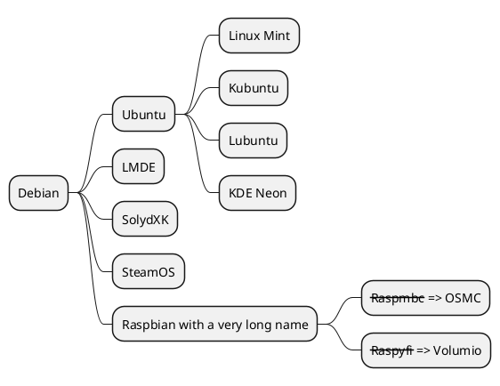

这一切，只不过为了在博客上方便做思维导图。markdown真是个好东西啊。 

<!-- more -->

vscode调试

* [Mac M1安装Java环境 - 知乎专栏](https://zhuanlan.zhihu.com/p/458932205)

Jekyll安装plantuml，以及格式转换

* [jeffreytse/jekyll-spaceship plantuml等](https://github.com/jeffreytse/jekyll-spaceship)

思维导图测试效果

