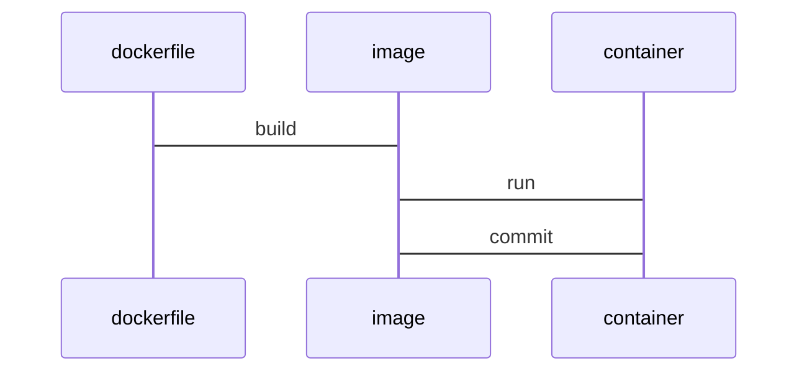

从安装换源到宿主机站点目录拷贝到web服务器容器。

<!--more-->

## 下载安装以及换源

* 下载Docker：[docker for desktop](https://docs.docker.com/get-docker/)
* [知乎-开心鸭-Mac设置docker国内镜像源](https://zhuanlan.zhihu.com/p/146876547)

额外的配置镜像源

* https://docker.mirrors.ustc.edu.cn
* https://registry.docker-cn.com

```json
{
  "experimental": true,
  "debug": true,
 "registry-mirrors": ["http://hub-mirror.c.163.com"]
}
```

## 实验🧪

在本身项目相关教程模糊或是配置繁琐，我们始终在搜寻适合我们的教程，又被这些繁琐的教程带了节奏，偏偏各种报错，连自己都不知道自己在配置什么了...一开始在急于求成完成项目的心境下还是真的太累了...

而且他们都是根据自己特例所进行的繁杂操作，不具有普众性。

因此，我们要极其清楚自己的目的：

* 文档在表达了哪些过程？过程是否存在模糊？
* 冗余淀长的配置是否合理？**在对比同类型文章的情况下**
* 在大方向上，自己要分几步走？



## 开始 >>>

安装及使用ubuntu镜像

```shell
docker pull ubuntu
# https://www.cnblogs.com/jzxy/articles/12106133.html
# -i: 以交互模式运行容器；-t: 为容器重新分配一个伪输入终端，通常与 -i 同时使用
docker run -it ubuntu /bin/bash
```

安装完成之后，我们退出重新看一遍发现：⚠️每次运行一次镜像都会生成新的初始环境的容器

情景1，临时测试删除容器`docker run -it --rm ubuntu `

情景2，由上发现此现象，所以我们需要指定容器运行。☑️

```sh
docker ps --help # 容器状态选项帮助
docker ps -a # 查看所有容器
docker exec -it d51808071b61 /bin/bash # 根据id执行相应容器,name也可以使用
apt-get update # apt-get不能下载？,更新apt-get
apt-get install -y ruby && apt-get install -y jekyll
```

至此Jekyll环境安装完成✅

## 可能刚好会遇见

不同平台的Jekyll产品安装方式以及迁移问题，还有一系列的相关警告

### 不同平台的安装的注意项

* 首先你得有一个可靠的网络环境——镜像源：[RubyGems - Ruby China](https://gems.ruby-china.com/)
* 官方对不同平台安装方式的额外说明：[Jekyll on Ubuntu](https://www.jekyll.com.cn/docs/installation/ubuntu/)
* 额外的编译包以及组件：[lxx1-ubuntu下安装Jekyll博客](https://www.lxx1.com/1951)
* 防漏补缺 ruby-full：[litifeng-ubuntu16.04安装jekyll 3.3.1](https://www.cnblogs.com/litifeng/p/6337614.html)

### 重装Jekyll for Ubuntu

gem与apt-get的区别，直白来说：如果管理或安装相应的ruby组件就用gem，经测试apt-get来安装jekyll存在一定的功能缺陷即使用异常，组件安装不全。所以在安装完ruby后使用gem进行安装Jekyll。

```shell
apt-get update
# 你的网络环境可能需要执行以下安装命令两次，
# 直至使用jekyll -v能够显示版本
apt-get install ruby ruby-dev make gcc nodejs
apt-get install ruby-full build-essential zlib1g-dev

echo '# Install Ruby Gems to ~/gems' >> ~/.bashrc
echo 'export GEM_HOME="$HOME/gems"' >> ~/.bashrc
echo 'export PATH="$HOME/gems/bin:$PATH"' >> ~/.bashrc
source ~/.bashrc

gem install jekyll bundler
```

### 将文件复制到其他平台上的问题

直接用`docker cp`复制博客目录到容器里，报错信息如下所示，看起来不对劲。

```sh
 
[!] There was an error parsing `Gemfile`:
[!] There was an error while loading `jekyll-theme-chirpy.gemspec`: No such file or directory - git. Bundler cannot continue.

 #  from /jekyll-theme-chirpy/jekyll-theme-chirpy.gemspec:13
 #  -------------------------------------------
 #
 >    spec.files         = `git ls-files -z`.split("\x0").select { |f|
 #      f.match(%r!^((assets\/(css|img|js\/[a-z])|_(includes|layouts|sass|config|data|tabs|plugins))|README|LICENSE|index|feed|app|sw|404|robots)!i)
 #  -------------------------------------------
. Bundler cannot continue.

 #  from /jekyll-theme-chirpy/Gemfile:5
 #  -------------------------------------------
 #
 >  gemspec
 #
 #  -------------------------------------------
 
```

删除了Gemfile，`bundle init &&  bundle install`效果也是不理想，“ the theme could not be found. (Jekyll::Errors::MissingDependencyException)”，于是在StackOverflow上找到解决方案。

>[stackoverflow-Jekyll theme could not be found](https://stackoverflow.com/questions/46380722/jekyll-theme-could-not-be-found)
>
>So, in short, simply follow the steps below:
>
>- **Add the theme-gem to your `Gemfile`**
>- add the theme to your `_config.yml` (correctly done already..)
>- Run: `bundle install` (just to make sure Bundler is able to use it)
>- Run: `bundle exec jekyll serve`

这也是后来才知道，我的主题是git clone的，使用_config.yml生效，Gemfile却没有添加相关主题；警告方面，看了下 [warning: already initialized constant APP_PATH #40518](https://github.com/rails/rails/issues/40518)的讨论，如下图警告其实也算正常的。

```sh
Warning: the running version of Bundler (2.1.2) is older than the version that created the lockfile (2.2.16). We suggest you to upgrade to the version that created the lockfile by running `gem install bundler:2.2.16`.
The dependency tzinfo (~> 1.2) will be unused by any of the platforms Bundler is installing for. Bundler is installing for ruby, x86_64-linux but the dependency is only for x86-mingw32, x64-mingw32, x86-mswin32, java. To add those platforms to the bundle, run `bundle lock --add-platform x86-mingw32 x64-mingw32 x86-mswin32 java`.
The dependency tzinfo-data (>= 0) will be unused by any of the platforms Bundler is installing for. Bundler is installing for ruby, x86_64-linux but the dependency is only for x86-mingw32, x64-mingw32, x86-mswin32, java. To add those platforms to the bundle, run `bundle lock --add-platform x86-mingw32 x64-mingw32 x86-mswin32 java`.
The dependency wdm (~> 0.1.1) will be unused by any of the platforms Bundler is installing for. Bundler is installing for ruby, x86_64-linux but the dependency is only for x86-mingw32, x64-mingw32, x86-mswin32. To add those platforms to the bundle, run `bundle lock --add-platform x86-mingw32 x64-mingw32 x86-mswin32`.
```

其实到整理已经可以正常使用Jekyll及主题了。


### 宿主机访问问题

一开始看些入门教程我还不知道容器还有其相关的网络模式，看了[脚本之家-Docker 网络模式（四种）详细介绍](https://www.jb51.net/article/97922.htm)，`docker run -it --net=host`，宿主机上输入localhost:4000，在测试之后还是不行...

最后，看来还是得上apache，将_site挂载到apache上部署访问，https://hub.docker.com/ 可在此官网搜寻apache docker镜像下载。虽然这么做成本高，却也是了解docker及web服务器使用很好的用例。

通过[docker中 运行httpd](https://blog.csdn.net/qq_40342026/article/details/90516993)文章的流程，这里以Windows为例:

```shell
# 创建并运行容器 httpd-test，而且将容器开放8000端口映射在主机80上
docker container run -p 8000:80 --name httpd-test httpd
# 以命令行交互式进入容器终端
docker exec -ti httpd-test /bin/bash
拷贝目录到httpd容器站点存放目录
docker cp c:\jekyllblog\_site\. a29403526515:/usr/local/apache2/htdocs
```

⚠️有关于“docker cp requires exactly 2 arguments”多半是字符写错了。另外，运行web服务器，也发现新的过程原由：为什么jekyll为要在 _config.yml 的permalink项追加`.html`的原因。

[Docker 安装 Apache](https://www.runoob.com/docker/docker-install-apache.html)中挂载方式过于麻烦，面对我们静态博客这种小型项目实在过于麻烦，还不如[docker cp](https://www.pianshen.com/article/327341505/)简单🤣。
