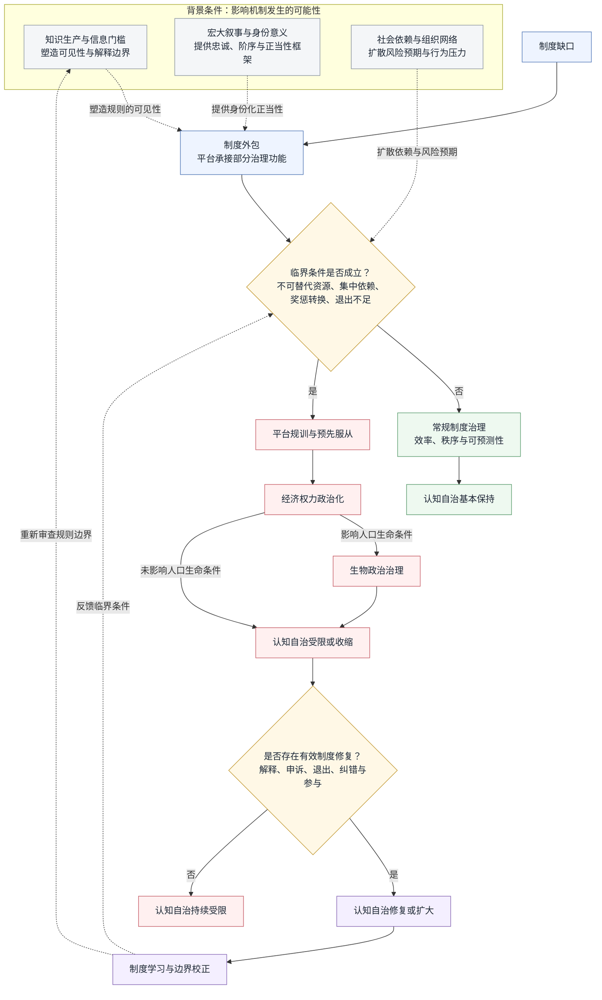
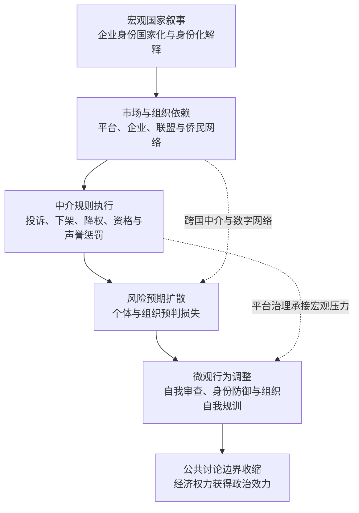

## 摘要

本文聚焦一个核心研究问题：**在中国电商平台治理中，制度外包在何种条件下会通过全景敞视、风险分类与依赖关系转化为主体的预先服从，并对认知自治产生何种影响？** 本文将制度外包界定为国家在制度能力不足或微观执行成本较高的条件下，将部分规则制定、信用识别、纠纷处理和行为约束功能嵌入平台等非国家中介的治理过程。研究以中国电商平台为主要案例场域，以跨国企业自我审查、NBA市场压力、数字侨民治理、孟晚舟事件和“竹知了”事件作为机制参照，而不将这些案例视为同质现象。

理论上，本文以制度外包作为核心解释概念，以福柯的政府性、规训权力和生物政治学解释治理能力如何通过可见性、风险分类和主体自我管理进入行为过程；同时结合人口学与算法治理研究，分析人口分类、资源分配及其对生命条件的影响。本文提出“制度缺口—中介能力—依赖集中—奖惩转换—主体化—认知自治”的机制链。研究认为，制度外包本身并不必然产生政治控制；只有当平台或其他中介掌握不可替代资源，依赖关系高度集中，经济资源能够转换为准入、流量、信用、身份或组织资格等具体奖惩，且风险预期在组织网络中扩散时，制度能力才可能获得政治效力。

本文进一步将认知自治操作化为信息自治、判断自治、行动自治和修正自治四个维度，用以评估被治理者能否获得必要信息、形成独立判断、在不承受不成比例惩罚的条件下行动，并通过申诉、退出和参与规则修订实现制度修正。本文的规范性结论是，教育型治理不应以最大化合规为目标，而应在制度效率与人口生命安全之间建立解释、异议保护、程序救济和权力反向可见的机制。

**关键词**：制度外包；平台治理；政府性；经济权力政治化；预先服从；认知自治；算法治理；教育型治理

## 一、绪论

### 1.1 现实与理论之间的张力

现代社会的制度想象通常以若干规范性词汇为核心：公开、平等、理性、参与、权利与尊严。然而，社会实际运行却无法只依靠这些抽象原则。任何组织都必须处理信息过载、个体误判、情绪传播、利益冲突、专业门槛、危机管理和资源有限等问题。由此，理论与现实之间形成了难以消除的结构性张力：理论要求把人视为能够自主判断的主体，现实却经常把人视为需要被教育、管理、筛选甚至暂时排除的行动者。

这种结构性张力并不只存在于政治领域，也存在于科学、经济学、企业管理和公共传播之中。科学共同体需要共享概念与方法，经济组织需要依靠专业分工和层级授权，公共传播需要将复杂内容压缩为可理解的符号，国家或企业在危机期间也可能需要限制部分信息的即时流动。换言之，**社会运行确实需要门槛、压缩与协调机制**。如果所有信息都以同样的速度、同样的形式、无差别地推向所有人，结果未必是更理性，可能也包括误读、恐慌、从众和集体误判。

但承认现实限制，并不意味着应当放弃理论上的批判。一个制度能够运行，只能说明它在某些条件下具有适应性；它能够降低某些成本，也可能把成本转移给另一些人。某种模式具有阶段性适用性，并不意味着它具有长期的规范正当性；某种手段能够实现既定目标，也不意味着它具有充分的制度正当性；某种组织能够维持高度一致，也不意味着它仍然具有学习和纠错能力。

本文由一个核心研究问题统摄：**制度外包在何种条件下会从提高平台治理能力的制度安排，转化为通过全景敞视、风险分类和依赖关系生产预先服从的政治化机制？** 围绕这一问题，本文进一步追问：制度外包的中介能力如何形成，经济资源如何转换为具体奖惩，主体如何在没有直接命令的情况下调整行为，以及认知自治如何成为评价治理正当性的规范标准。

本文不是对某一企业、某一国家或某一具体事件进行完整的经验调查，也不试图证明所有民族品牌支持者都受到操控。本文采取概念分析、批判性理论综合与机制导向的比较案例分析方法，将品牌叙事、网络群体、信息控制和组织封闭性等现象置于科学知识社会学、社会理论与传播政治的框架中考察，从而区分经验事实、理论解释和规范性主张。

### 1.2 研究问题与中心论题

本文将上述核心问题分解为四个分析环节：第一，平台如何在制度缺口中形成规则执行和信用治理能力；第二，哪些条件会使这种中介能力转化为经济权力；第三，全景敞视、风险分类和依赖关系如何促成主体的预先服从；第四，如何通过认知自治指标评估治理后果，并以教育型治理和制度纠错降低自治损失？

本文的中心论题是：**制度外包首先是一种在制度缺口中建设微观治理能力的安排；当中介资源具有不可替代性、依赖关系高度集中、经济资源能够转换为具体奖惩，且风险预期通过组织网络扩散时，制度能力就可能转化为经济权力政治化。福柯的政府性与全景敞视理论说明，这一转化不必依赖持续的直接命令，而可以通过可见性、规范化判断、风险分类和主体自我管理实现。本文以认知自治四维指标评估这一过程对被治理者的信息获得、判断形成、行动空间和制度修正能力的影响。**

### 1.3 核心研究视角、研究框架与研究方法

本文的核心研究视角，是把治理理解为一个同时发生在 **知识、制度、人口、主体与规范评价** 五个层面的过程。第一，治理通过思想共同体（thought collective）、范式（paradigm）和宏大叙事规定什么能够被看见、被解释为事实以及被赋予何种公共意义。第二，治理通过平台、企业、侨民组织和技术基础设施，将国家或组织目标转化为规则、算法、信用、身份认证和资源配置。第三，治理不只针对孤立个体，也面向被统计、分类和管理的人口，涉及健康、安全、流动、劳动能力、风险分布和生命条件。第四，治理通过规训、全景敞视、风险预期和自我管理，使主体主动调整自身行为。本文最后以认知自治作为规范性标准，考察被治理者能否理解、质疑、参与和修正影响自身生活的规则。

据此，本文将原有的“思想共同体—中介治理—主体化—规范评价”四层框架扩展为五个相互衔接的分析层次：

| 分析层次 | 核心问题 | 理论资源 |
|---|---|---|
| 知识生产 | 什么被视为事实，反例如何被处理？ | 弗莱克、库恩、默顿 |
| 中介治理 | 国家如何借助平台、企业与社会组织执行规则？ | 韦伯、Liu、跨国治理研究 |
| 人口生命管理 | 哪些人口被分类、保护、监测和分配风险？ | 福柯生物政治学、治理术 |
| 主体化机制 | 个体和群体如何在可见性、规范与风险预期中自我调整？ | 福柯规训权力、全景敞视、政府性 |
| 规范评价 | 被治理者是否拥有理解、质疑、行动和修正的能力？ | 哈贝马斯、弗莱雷、认知自治 |

这一框架的中心不是把国家、平台或组织预设为单一行动者，而是分析不同主体如何通过授权、依赖、数据、市场、身份和风险形成结构性耦合。制度外包解释治理能力如何被中介化；全景敞视解释中介化治理如何转化为持续可见性和自我监督；生物政治学则进一步追问，这些分类和风险分配如何影响人口的生命条件。由此，论文的核心解释链可以表述为：**制度缺口促成中介能力，中介能力在依赖集中和奖惩可转换的条件下获得政治效力，政治效力通过规训、治理术和人口分类进入主体与群体的自我管理，最终可能造成认知自治收缩；教育型治理和制度纠错则构成打断这一链条的规范性方案。**

方法上，本文采取概念分析与机制导向的案例研究。中国电商平台治理是主要分析场域，用于考察制度外包如何形成中介能力并进入日常规则执行；跨国互联网企业自我审查、NBA市场压力、数字侨民治理、孟晚舟事件和“竹知了”事件仅作为机制参照，用于检验经济依赖、身份网络、平台规则与预先服从之间是否存在可比较的结构。本文按照“制度缺口—中介资源—依赖结构—奖惩转换—主体调整—认知自治后果”的分析模板识别机制，并明确区分制度事实、案例材料、理论推论和规范性判断。

### 1.3.1 核心概念的操作化：认知自治四维指标

本文将“认知自治”界定为：被治理者在不承受不成比例的组织或制度惩罚条件下，获取与自身利益相关的信息、形成独立判断、据此采取行动，并通过申诉、退出和参与规则修订实现制度修正的综合能力。该概念不是心理状态的直接测量，而是一个用于案例比较的制度性分析指标。

| 维度 | 操作性定义 | 主要可观察指标 | 受损表现 |
|---|---|---|---|
| 信息自治 | 获取、理解与自身利益和生命条件相关信息的能力 | 规则是否公开；分类依据是否说明；数据来源是否可知；是否存在多元信息渠道 | 信息被截断、关键标准不公开、只能接收单一叙事 |
| 判断自治 | 比较证据、理解不同解释并形成独立判断的能力 | 是否允许反例；是否提供理由说明；是否存在独立评价和公共讨论空间 | 异议被道德化；事实被身份化；反例无法进入讨论 |
| 行动自治 | 在不承受不成比例惩罚的条件下表达、选择和行动的能力 | 是否存在合理退出机制；处罚是否与行为相称；市场和平台依赖是否过度集中 | 自我审查；因预期损失而放弃合法表达；无法选择替代服务 |
| 修正自治 | 对错误分类、规则执行和组织判断提出申诉并推动修正的能力 | 是否有解释义务、申诉、复核、纠错、补偿和参与规则修订机制 | 分类错误无法纠正；权力不承担误判责任；规则长期封闭 |

四个维度具有递进关系，但不构成简单线性量表：信息自治是判断自治的必要条件，判断自治影响行动自治，修正自治则决定个体和群体能否把局部异议转化为制度学习。本文在案例分析中不计算单一总分，而是通过上述指标比较不同治理安排对认知自治的促进或限制方式。

### 1.3.2 研究边界与案例定位

为避免研究对象过度扩张，本文将中国电商平台治理设为主要分析场域，重点考察平台如何在制度缺口中形成规则执行、信用识别和纠纷处理能力，以及这些能力在何种条件下可能转化为预先服从。跨国企业自我审查、NBA市场压力、数字侨民治理、孟晚舟事件和“竹知了”事件不承担总体代表性功能，而仅作为机制参照：它们分别用于说明市场依赖、身份网络、国家叙事、商誉治理和平台化内容处理如何呈现与主案例相似的权力转换结构。

本文不试图证明所有平台治理都具有政治性质，也不试图将中国案例概括为某种国家或文化的本质特征。本文的经验主张限于：在特定的制度缺口、资源依赖、奖惩转换和风险预期条件叠加时，平台治理可能超出交易秩序的功能边界，并对认知自治产生结构性影响。本文的规范性主张则是：这种影响应当通过解释义务、比例原则、有效申诉、可跨越门槛和权力反向可见等机制受到约束。由于本文主要采用公开材料和机制导向案例分析，相关结论属于理论解释与条件性推论，而不是对总体因果效应的统计估计。

### 1.4 论文结构说明

全文围绕“制度外包如何在特定条件下转化为经济权力政治化，并进一步影响认知自治”这一核心问题展开。论证首先从现实治理与知识生产之间的张力出发，说明信息、意义和人口分类如何构成治理的知识基础；继而借助制度外包分析治理能力如何嵌入平台等非国家中介，再通过政府性、规训权力和生物政治学考察这些能力如何进入个体行为与人口生命条件；最后以教育型治理和认知自治作为规范回应，讨论如何通过解释、申诉、退出、纠错和参与机制限制权力的单向运行。全文因此形成“问题提出—理论界定—知识生产—制度中介—主体化—社会后果—规范修复—结论收束”的总体结构。

第一章“绪论”承担提出研究问题、建立核心分析视角、界定关键概念、说明研究方法与案例边界以及预告全文论证路径的功能。本章从现实治理与理论解释之间的张力出发，说明本文为何需要同时考察知识生产、信息门槛、制度外包、平台规训、人口治理与认知自治；继而将中国电商平台治理确立为主要分析场域，并把跨国企业、侨民组织和相关公共事件限定为机制参照。绪论由此完成从问题意识到研究设计的转换，为后续章节提供概念边界、分析顺序和规范评价标准。

第二章“理论基础”界定本文所使用的理论工具及其分工。制度外包用于解释治理能力如何由国家机关延伸至平台等非国家中介；福柯的政府性、规训权力与生物政治学用于解释这种能力如何通过可见性、风险分类和主体自我管理进入个体与人口；人口学和算法治理研究用于分析分类标准如何影响资源分配和生命条件；认知自治则作为评价治理后果的规范标准。本文据此按照“知识生产—制度中介—主体化—规范评价”的顺序展开论证。

第三章至第五章构成知识生产、意义组织与社会阶序的递进分析。第三章讨论信息门槛的双重性质，分析隐私保护、专业资格、风险控制和危机管理等门槛的现实必要性，并考察门槛何时从风险管理转化为解释权垄断。第四章讨论宏大叙事与身份化意义，说明信息进入公共领域后如何通过国家、民族、企业和身份框架获得解释，以及企业身份国家化如何使商业争议被重新理解为立场、忠诚或共同体归属问题；孟晚舟事件作为宏观机制参照，用于说明复杂事实如何被国家叙事重新组织。第五章进一步分析宏大叙事如何与社会阶序相连，考察身份认同、象征权力和代理性地位如何促使个体主动维护组织秩序。

第六章和第七章转向制度外包及其社会后果。第六章分析中国电商平台如何在制度缺口中形成规则制定、信用识别、纠纷处理和行为约束能力，并进一步考察平台规训、算法分类和“竹知了”事件所呈现的微观表达治理。当平台资源具有不可替代性、依赖关系高度集中、经济资源能够转换为具体奖惩，且风险预期通过组织网络扩散时，中介治理就可能超出交易秩序的范围，转化为经济权力政治化。第七章分析这一过程带来的责任外部化、算法不透明、创新和公共讨论空间收缩，以及不同人口群体承担不均等风险等社会成本。

第八章至第十二章讨论规范回应、跨国延伸与认知自治。第八章提出“教育人与筛选人”的规范问题，区分针对能力与责任的必要筛选和针对身份与服从的封闭性筛选。第九章将分析范围延伸至侨民组织、数字网络和跨国企业，考察制度外包、身份网络、市场依赖和预先服从之间是否存在可比较机制。第十章综合经济权力政治化、全景敞视和预先服从，提炼制度能力转化为政治效力的临界条件。第十一章提出教育型治理的制度原则，第十二章则将其具体化为认知自治的四个维度：信息自治、判断自治、行动自治和修正自治。

第十三章和第十四章承担论文的收束功能。第十三章说明理论整合、案例选择、证据来源和因果识别方面的局限，明确本文结论属于理论解释与条件性推论，而非总体因果效应的统计估计。第十四章回到核心研究问题，概括制度外包如何在特定条件下生产预先服从，以及如何通过教育型治理、制度纠错和有效申诉机制维护或修复认知自治。其他案例仅在相应章节中承担机制参照功能，详细章节说明见本文附录 A。

### 1.5 核心分析逻辑

本文的核心逻辑不是一条必然发生的线性因果链，而是一组具有条件性和分支性的机制关系。国家或公共机构在制度供给不足、专业能力有限或微观执行成本过高时，可能将规则制定、身份认证、信用识别和纠纷处理等功能外包给平台等非国家中介。平台由此积累数据、技术、市场和组织资源，并承担部分准公共治理职能。

制度外包只有在特定条件下才可能转化为政治化治理。当平台掌握不可替代资源，用户、商家或组织形成集中依赖，经济资源能够转换为准入、降权、信用、账户或身份等具体奖惩，且退出、申诉和复核机制不足时，主体会根据预期损失进行自我调整。数字记录、风险分类和持续可见性由此将平台规则转化为生产预先服从的规训机制；当这些分类和奖惩进一步影响就业、福利、医疗、流动和安全等生命条件时，平台治理便呈现出生物政治特征。

这一过程并非不可逆转。解释义务、比例原则、异议保护、有效申诉、合理退出、错误修复和参与规则修订，能够限制权力的单向运行，并帮助被治理者恢复信息、判断、行动和制度修正能力。下图以条件分支呈现上述机制，表明制度外包并不必然导致政治化治理。


flowchart TD
    subgraph X[背景条件：影响机制发生的可能性]
        X1[知识生产与信息门槛 塑造可见性与解释边界]
        X2[宏大叙事与身份意义 提供忠诚、阶序与正当性框架]
        X3[社会依赖与组织网络 扩散风险预期与行为压力]
    end

    A[制度缺口]
    B[制度外包 平台承接部分治理功能]
    C{临界条件是否成立？ 不可替代资源、集中依赖、奖惩转换、退出不足}
    
    D[常规制度治理 效率、秩序与可预测性]
    E[平台规训与预先服从]
    F[经济权力政治化]
    G[生物政治治理]
    
    H[认知自治基本保持]
    I[认知自治受限或收缩]
    J{是否存在有效制度修复？ 解释、申诉、退出、纠错与参与}
    K[认知自治修复或扩大]
    L[认知自治持续受限]
    M[制度学习与边界校正]
    
    A --> B --> C
    C -->|否| D --> H
    C -->|是| E --> F
    F -->|影响人口生命条件| G --> I
    F -->|未影响人口生命条件| I
    I --> J
    J -->|是| K --> M
    J -->|否| L
    
    X1 -.塑造规则的可见性.-> B
    X2 -.提供身份化正当性.-> B
    X3 -.扩散依赖与风险预期.-> C
    M -.重新审查规则边界.-> X1
    M -.反馈临界条件.-> C
    
    classDef background fill:#f4f6f8,stroke:#8a949e,color:#1f2937;
    classDef base fill:#eef4ff,stroke:#5278b8,color:#1f2937;
    classDef decision fill:#fff8e6,stroke:#c49a35,color:#1f2937;
    classDef normal fill:#eef9f0,stroke:#5a9b6d,color:#1f2937;
    classDef risk fill:#fff0f0,stroke:#c65d67,color:#1f2937;
    classDef norm fill:#f4efff,stroke:#8666b5,color:#1f2937;
    
    class X1,X2,X3 background;
    class A,B base;
    class C,J decision;
    class D,H normal;
    class E,F,G,I,L risk;
    class K,M norm;


### 1.6 数字时代人口生命安全与算法治理的批判性反思

数字治理改变了人口生命安全的组织方式。健康、安全、流动、就业、金融服务和社会福利越来越依赖数据采集、风险评分、身份认证和预测性分类。算法治理的优势在于能够处理大规模信息，提前识别风险并提高资源配置效率；但其危险也在于，人口不再只是被动接受公共政策的对象，而是被转化为持续可计算、可比较和可预测的数据总体。算法由此不只是技术工具，也成为一种社会技术性的规制基础设施（Kitchin, 2017; Yeung, 2018）。生命安全由此可能从公共保障问题转化为风险管理问题，个体则可能从具有具体处境的人转化为风险等级、信用标签和统计类别。

从福柯的生物政治学看，关键问题不是数字技术是否“中立”，而是技术如何参与定义正常人口、危险人口、优先保护人口和可被延迟处理的人口。算法系统通常以风险控制、公共安全、效率和精准治理为名运行，但其分类标准可能继承历史偏见，并把不平等结果包装成技术判断；即使不直接使用受保护属性，数据代理变量也可能产生差别影响（Barocas & Selbst, 2016）。与此同时，算法决策的不透明性会使受影响者难以理解判断依据和责任归属（Pasquale, 2015）。被分类者往往只能看到结果，却无法充分知道数据来源、模型逻辑、风险权重和申诉路径。此时，算法不仅在观察个体，也在分配生命机会：它可能影响一个人获得工作、信贷、医疗资源、平台流量、社会救助或跨境服务的可能性。

更值得警惕的是，算法治理可能把责任分散到国家部门、平台企业、技术供应商和数据服务机构之间。决策发生在多个中介环节，任何单一主体都可以声称自己只是执行规则、提供技术或遵循市场需求。制度外包在这里呈现出新的生命政治维度：公共机构把人口识别、风险预警和资源配置嵌入平台，平台又以商业规则和技术标准执行差异化管理，最终形成个体处于高可见状态、而治理权力的运行机制缺乏对等透明性的结构性不对称。

因此，人口生命安全不能仅仅被理解为提高预测准确率或降低治理成本。更重要的问题是：谁定义风险，谁承担误判，谁决定哪些生命优先获得保护，谁能够质疑统计分类，以及个体和群体能否参与影响自身生命条件的规则制定。教育型治理在数字时代的任务，不只是培养个体使用技术和遵守规则的能力，还应当培养人口层面的数据素养、风险判断、统计理解和公共参与能力，使被治理者能够知道自己如何被看见、为何被分类以及如何对分类提出异议。

由此，本文对算法治理的批判并非拒绝技术，而是要求将技术效率置于可解释、可审查、可申诉和可修正的公共制度之中。只有当算法的分类标准、数据来源、风险后果和责任归属能够被社会观察和质疑时，数字治理才可能从单向的生命管理转化为具有公共学习功能的教育型治理。

#### 1.6.1 算法排挤与人口生命安全：三个现实案例

第一，预测性治安可以说明历史治理偏差如何被算法转化为未来风险。预测模型通常依赖既有报警记录、逮捕数据和警务资源分布，而这些数据并非对“真实犯罪”的透明记录，也包含长期以来的过度巡查和选择性执法。当历史上被更密集监控的社区因此被标记为高风险区域时，警力会进一步集中，新的执法数据又会反过来强化原有模型，由此形成“历史偏差—风险分类—资源集中—偏差再生产”的反馈循环（Lum & Isaac, 2016）。本文不把这一机制简单概括为“算法必然歧视”，而是将其视为人口分类如何重构风险分布和生命安全条件的案例。

第二，美国刑事司法中的COMPAS风险评估争议表明，算法公平并不存在脱离社会价值的单一技术答案。ProPublica的调查指出，不同族群在误报高风险方面存在差异，但相关研究也显示，选择何种公平指标会影响对算法表现的评价（Angwin et al., 2016）。这一案例的理论意义不在于证明某个指标单独决定正义，而在于说明：当人口群体被编码为风险类别时，公平问题同时涉及统计标准、法律程序、历史不平等和被分类者的申诉能力。

第三，自动化福利审核可以说明算法如何影响人口的基本生活条件。Eubanks（2018）对美国自动化福利系统的研究表明，当贫困人口必须通过复杂的数据验证、资格筛查和错误纠正程序获得救助时，技术系统可能把本应由制度承担的证明成本转移给最缺乏资源的群体。类似机制不必表现为显性的拒绝，也可能表现为申请延迟、材料重复提交、错误分类和无法有效申诉。由此，算法治理不只是效率问题，也涉及哪些人口能够及时获得生存资源以及哪些群体需要承担更多制度摩擦。

这些案例共同表明，数字治理的风险并不只来自算法是否“准确”，还来自算法将什么定义为风险、将谁置于风险之中，以及分类结果如何影响资源、机会与生命安全。对教育型治理而言，关键要求不是让所有成员掌握模型代码，而是使受影响人口能够理解分类的基本逻辑、知道错误如何产生、获得有效申诉，并参与决定哪些分类标准具有公共正当性。

### 1.7 人口学知识与人口治理：从统计对象到公共主体

将“人口”纳入本文的核心视角，并不意味着把人口学仅仅作为人口数量、年龄结构或出生率的背景资料。人口学知识通过统计分类、生命表、迁移数据、年龄结构、劳动参与率和健康指标，把分散的个体转化为可以观察、比较和干预的总体。现代人口学不仅描述人口过程，也通过测量、模型和人口转变研究解释人口结构如何与社会发展和公共政策相互作用（Lee, 2003; Preston et al., 2001）。马尔萨斯关于人口增长与资源约束的讨论，显示人口曾被理解为国家资源和生存秩序的问题；人口转变理论则进一步将出生率、死亡率、城市化和年龄结构纳入现代国家的发展规划（Malthus, 1798; Notestein, 1945）。

然而，人口统计并不只是被动地记录社会。Hacking（1990）和Desrosières（1998）指出，统计分类既描述对象，也参与建构对象：一旦国家和组织按照“失业人口”、“高风险人口”、“老年人口”、“流动人口”或“脆弱群体”等类别分配资源和责任，这些分类就会进入现实治理并改变人们的生活机会。福柯关于人口、安全和治理术的分析，正是要说明人口如何成为一种既具有生物事实意义、又具有政治管理意义的知识对象（Foucault, 2007, 2008）。

因此，本文将人口学与生物政治学置于互补关系中。人口学提供描述人口结构、生命过程和群体差异的知识工具；生物政治学则追问这些知识如何被纳入安全、福利、劳动、迁移、健康和资源配置机制。人口不是天然存在、等待治理的客体，而是在统计标准、行政分类、技术系统和公共叙事中不断被生产为“可治理人口”。

这一视角也要求对算法公平研究保持批判性。算法要判断不同群体是否受到不平等对待，往往需要收集种族、性别、年龄、残障、迁移身份等敏感人口属性；但人口数据的收集本身可能扩大监控基础设施、造成误分类，并削弱群体自行定义身份和不公的能力（Andrus et al., 2022）。Stypinska（2023）关于“AI年龄歧视”的研究进一步说明，老年人口可能在数据集、模型设计、AI话语、服务结果和用户界面等多个层面被忽视或排除。

由此，本文对人口治理的规范要求包括：人口分类应当具有可解释性；风险和资源分配应当可以审查；敏感数据的收集应当具有明确目的和期限；错误分类必须有可行的申诉和修复机制；被治理群体应当参与决定有关自身生命条件的分类标准。只有这样，人口统计和算法治理才可能从单向管理工具转化为支持公共学习和认知自治的制度资源。

## 二、理论基础：思想共同体、范式与公共理性
第一章提出了本文的核心问题、分析范围和机制链条。本章进一步界定解释这些问题所需的理论工具，说明知识生产、制度中介、主体化与规范评价分别由哪些概念承担，并明确各理论在全文中的解释边界。

### 2.1 弗莱克：事实总是在思想共同体中被看见

弗莱克的科学知识社会学对本文最重要的启示，是事实从来不是完全脱离共同体而自动呈现的对象。弗莱克指出，认知是一种集体活动；个体总是在某种思想风格、时代和思想共同体中认识现象。思想共同体通过共享的概念、情绪、训练和判断标准，使成员以相似方式感知、评价和使用所认识的事物（Fleck, 1979）。

思想风格并不只是显性的理论，更包括那些很少被意识到的前提：什么问题值得研究，什么证据算相关，什么反例可以被接受，什么表达被视为严谨，什么表达被视为情绪化。正因为这些前提往往构成共同体的日常常识，成员通常不会把它们体验为外部强制，而会把它们体验为“事情本来就是如此”。

这使弗莱克能够解释一个常见现象：封闭性共同体并不一定依靠所有成员共同制造虚假信息来维持。更可能的情况是，成员共享一套思想风格，因此他们在面对相同材料时会选择不同的注意对象，并以相似方式解释不一致。对共同体外部的人而言，反例可能是事实；对共同体内部的人而言，反例可能只是异常、噪音、特殊情形或尚未被纳入模型的边缘材料。

弗莱克的洞察也不能被简化为“事实都是假的”或“真理只是权力”。他的理论同时保留了思想和事实发生变化的可能性：新的思考方式能够使新的事实变得可见，新的事实也可能迫使思想风格发生调整。正因如此，问题不在于是否存在思想风格，而在于一个思想共同体是否有能力意识到自身的风格，是否允许外部经验进入，是否允许事实反过来改变共同体的语言。

### 2.2 库恩：共同范式既生产秩序，也吸收反常

库恩对科学发展的分析进一步说明，共同体需要范式才能进行“常规科学”。范式提供共同的问题、工具、评价标准和典范性解题实例，使科学家不必在每一次研究中重新争论全部基础问题。成熟科学因而能够在既定框架内持续解决问题，并积累局部成果（Kuhn, 1962/1970）。

然而，范式也具有保守性。常规科学的主要任务不是不断怀疑全部基础，而是在既有矩阵内解决谜题。因此，反常在初期往往不会立即导致范式崩溃，而是被理解为测量误差、技术限制、特殊条件或待解决的边缘问题。只有当反常不断积累，并且触及既有框架的核心能力时，危机和范式转换才可能发生。

这对理解组织和社会叙事具有启发意义。一个组织的共同叙事类似于一种社会范式：它规定什么问题重要，什么解释具有合法性，什么行为被视为忠诚，什么批评被视为破坏。它能够降低协调成本，也能够把不符合叙事的经验推到边缘。因而，组织的问题不在于拥有共同叙事，而在于是否能够让叙事受到现实反常的持续检验。

### 2.3 默顿：共同体的健康取决于有组织的怀疑

弗莱克和库恩解释了共同体如何形成认知秩序，默顿则提供了一个重要的规范性参照。默顿关于科学规范的经典论述通常被概括为共同性、普遍主义、无私利性和有组织的怀疑（Merton, 1973）。这些规范不是对科学实践的简单经验描述，而是对科学共同体应当如何维持知识可信度的制度性理想。

其中，“有组织的怀疑”尤其值得关注。它意味着怀疑不应只依靠个别人的勇气，而应成为共同体内部的制度安排：研究结果可以被复核，权威可以被质疑，证据可以被重新解释，新的成员可以通过论证而不是身份进入讨论。一个组织如果要求成员共享荣誉，却不允许成员检验事实；如果允许赞美，却不允许反驳，那么它即使拥有严密的内部秩序，也已经背离了知识共同体的学习机制。

这为“教育人”提供了一个更具体的含义。教育不只是传播正确结论，也不是把成员训练成同一套口号的重复者，而是培养其理解证据、识别推理、提出异议和接受修正的能力。换言之，教育应当把“怀疑的能力”本身传递给成员。

### 2.4 韦伯与哈贝马斯：效率不等于合法性

韦伯的理性化分析解释了现代组织为什么偏爱计算、预测、分类、指标、规则和可执行程序。理性化能够提高协调效率，使复杂社会获得稳定的行政能力；但它也可能使人被转化为数字、对象和可管理单位，让手段的可计算性最终压倒对目的本身的价值判断（Weber, 1978）。

因此，社会治理不能只问“这种手段是否有效”，还必须问“它服务于什么目标”、“代价由谁承担”、“谁有权界定成功”、“失败是否能够被公开承认”。工具理性的危险，不在于工具理性本身，而在于它把一部分问题的解决方式扩张成全部问题的判断方式。效率能够告诉我们怎样更快地实现某个目标，却不能单独告诉我们这个目标是否正当，也不能告诉我们谁被牺牲在效率之中。

哈贝马斯则从公共领域和交往理性的角度补充了这一点。公共领域并非简单的信息发布场，而是私人个体围绕共同事务形成公共意见、运用公共理性并对权力进行批判的空间（Habermas, 1989）。当国家、公司或利益集团借助公共关系技术预先框定公共讨论，使公众主要只能对已经完成的决策表示赞同时，公共领域就可能退化为一种“伪公共领域”。

福柯进一步改变了“权力只来自上方命令”的理解。在《规训与惩罚》中，权力通过等级化观察、规范性判断和检查，把个体转化为可记录、可比较、可纠正的“案例”；全景敞视的关键也不是持续实际监视，而是被监视的可能性迫使主体按照规范进行自我调整。在治理术的视角下，现代权力不只禁止和惩罚，也通过设计环境、分配风险、规定正常性和塑造主体的自我利益来“引导行为”（Foucault, 1991, 2007, 2008）。这为本文解释“预先服从”提供了重要工具：企业和个体不必等待直接命令，而会根据平台规则、市场先例、法律责任和身份评价，预判某种行为可能带来的收入损失、账户限制、法律风险或组织排斥，并在行动之前主动调整自己的表达与行为。换言之，主体并非因为惩罚已经发生才服从，而是因为对潜在后果的风险判断，将外部规范转化为持续的自我监控和自我约束。

哈贝马斯的理论使“信息公开”的含义变得更加严格。公开不是把未经解释的资料倾倒给公众，也不是用透明的形式制造新的不可理解性。真正重要的是，受影响者是否有机会提问、回应、提出反例并参与形成判断。因此，信息制度的规范目标不是无差别开放，而是实现**可理解、可质疑、可回应和可参与**。

### 2.5 理论综合：从事实可见性到人口生命治理

上述理论并非彼此并列的思想资源，而是分别解释第一章所提出的五层治理链条。弗莱克和库恩处理的是知识生产问题：思想共同体和范式如何决定什么被看见、什么被承认为事实，以及反常如何被吸收或推动框架改变。默顿则提供共同体自我纠错的制度标准，说明有组织的怀疑、普遍主义和可复核性如何防止知识秩序转化为封闭权威。

韦伯、哈贝马斯和福柯分别揭示了治理的不同维度。韦伯解释制度如何通过计算、分类和程序提高组织能力，同时产生工具理性扩张的风险；哈贝马斯说明公共判断必须建立在可理解、可回应和可质疑的交往关系上；福柯则说明权力如何通过规训、治理术和生物政治，将知识分类、风险分配和生命管理嵌入主体的行动环境。三者结合，使本文能够同时分析治理的行政效率、公共正当性和主体化后果。

在这一理论组合中，人口不是一个额外加入的研究对象，而是连接知识、制度与生命条件的关键中介。人口学和统计分类将个体转化为可观察的总体；制度外包将这些分类嵌入平台、企业和社会组织；全景敞视与治理术则使分类结果通过可见性、风险预期和自我管理进入主体行为。由此，本文所说的“制度外包”不仅是治理职能的重新分配，也是人口知识和生命管理能力的中介化部署。

理论综合的核心判断可以表述为：**知识生产规定可见性，人口分类规定可治理性，中介制度规定治理如何执行，主体化机制规定治理如何被内化，认知自治则提供评价这一过程的规范标准。** 这一区分也限制了本文的理论外推：并非所有平台分类都构成生物政治，也并非所有信息限制都构成规训；只有当分类、风险和资源分配持续影响群体的生命条件，并通过可预期的奖惩塑造主体行为时，才有必要将其放在政府性和生物政治的框架中分析。

### 2.6 理论分工与解释机制排序

为避免理论资源的并列堆叠，本文将理论体系分为一个核心解释框架、三个机制性补充和一个规范性评价层。核心框架是“制度外包—政府性—认知自治”：制度外包解释治理能力如何通过平台等中介组织化，政府性解释这些能力如何通过环境设计、风险分类和主体自我管理进入行为过程，认知自治则评价这一过程是否保留了被治理者理解、判断、行动和修正的能力。

| 理论层级 | 理论资源 | 主要解释对象 | 在本文中的功能 |
|---|---|---|---|
| 核心机制一 | 制度外包与平台治理 | 治理能力如何转移到非国家中介 | 解释平台如何承担规则制定、信用识别、纠纷处理和行为约束 |
| 核心机制二 | 福柯的政府性、规训权力与生物政治学 | 权力如何通过可见性、分类、风险和主体化发挥作用 | 解释制度能力如何转化为预先服从，并如何影响人口生命条件 |
| 核心机制三 | 认知自治 | 被治理者能否保持独立的认识与行动能力 | 作为案例比较和规范评价标准 |
| 机制补充一 | 弗莱克的思想共同体 | 事实如何在共同体内部获得可见性和正当性 | 解释宏大叙事与反例吸收的认识论条件 |
| 机制补充二 | 人口学与统计治理 | 人口如何被测量、分类和组织为治理对象 | 解释风险评分、人口分类与资源分配的知识基础 |
| 机制补充三 | 算法治理与经济权力政治化 | 分类、依赖和奖惩如何嵌入技术与市场系统 | 解释平台规则如何产生差别影响和跨境服从 |
| 规范性补充 | 哈贝马斯与弗莱雷 | 公共讨论、教育和主体能力的规范条件 | 解释为什么透明、异议保护和教育机制能够构成制度纠错 |

韦伯、库恩、默顿、布迪厄和霍耐特在本文中不再承担独立的主解释任务，而作为限定性或补充性文献使用：韦伯用于说明理性化和组织计算，库恩与默顿用于补充知识共同体的范式稳定与纠错机制，布迪厄用于说明象征权力，霍耐特用于补充承认与主体尊严问题。本文并不对这些理论作完整重构，而是根据核心研究问题，分别提取其关于知识生产、范式稳定、理性化、象征权力与主体承认的解释机制。

本文理论排序因此是：**先解释治理能力从何而来，再解释治理如何进入主体和人口，最后评价这种治理是否保留认知自治。** 这一排序也构成后文章节原则：先讨论制度外包，再讨论全景敞视和生物政治，随后分析平台与跨国案例，最后提出教育型治理和制度纠错。

## 三、信息门槛的双重性质：治理工具与权力边界
第二章说明了知识共同体、政府性、规训权力和生物政治学在本文中的理论分工。本章据此从知识生产的制度条件切入，考察信息门槛何时服务于风险控制与专业分工，何时又可能转化为对解释权和质疑权的垄断。

### 3.1 为什么信息不能无差别公开

对信息门槛的批评若忽视现实条件，就会落入一种简单的透明主义。复杂信息存在专业背景、风险等级和处理顺序。涉及个人隐私的信息需要保护，涉及高风险技术的信息可能需要资格认证，涉及正在进行的司法或安全事务的信息可能需要阶段性限制，涉及组织内部责任的信息也可能需要程序化调查。

此外，信息的增加不会自动带来理性的增加。个体具有有限的注意力、时间和认知资源；平台传播又往往偏好简短、冲突和情绪化内容。未经组织的信息可能被断章取义、误读或动员。由此，信息门槛具有某种治理意义：它可以降低误操作、隐私侵害、恐慌扩散和协调失灵的风险。

但这种必要性必须被严格限定。信息门槛不是一个可以无限扩张的概念，更不能以“公众不理性”为理由把所有不便于组织的事实排除在外。应当至少区分三种门槛：

| 门槛类型 | 合理目的 | 必要保障 |
|---|---|---|
| 能力门槛 | 防止未经训练者进行高风险操作 | 明确标准、培训路径、周期性复核 |
| 程序门槛 | 保护隐私、安全和调查秩序 | 明确期限、范围、理由和监督机制 |
| 权力门槛 | 控制谁能知道、解释和质疑 | 应满足最严格的正当性要求，并接受外部监督与有效申诉 |

能力门槛与权力门槛之间的区别尤其重要。能力门槛的原则是“经过学习即可进入”；权力门槛的逻辑则常常是“只有特定身份才有资格知道”。前者可以扩大参与者，后者容易固化等级秩序。一个组织如果设置门槛，却不提供学习、培训和申诉的路径，那么门槛就不再是能力保护，而可能成为身份排除。

### 3.2 信息门槛何时转化为解释权垄断

信息门槛的危险不在于它隐藏了一部分信息，而在于它可能同时垄断三个环节：一是决定什么信息可以被看见，二是决定如何解释这些信息，三是决定谁有资格质疑解释。三者一旦集中在同一组织手中，组织就不仅管理信息，还管理现实的公共定义。

在这种结构中，组织可以把自己的利益描述为公共利益，把自身的失败描述为共同体受到攻击，把内部异议描述为外部敌意的渗透。批评者不再被视为提出了一个可讨论的观点，而被归入不忠、无知、别有用心或不顾大局的类别。此时，信息门槛已经完成了从风险控制到身份控制的转化。

因此，信息限制的正当性至少需要满足五个条件：目的明确、范围必要、期限有限、程序可审查、成员可通过教育逐步获得更高参与能力。缺少这些条件时，组织越强调公众非理性，越需要被追问：它究竟是在降低社会风险，还是在降低自身被问责的风险？

如果说信息门槛控制的是事实的进入条件，那么宏大叙事控制的则是事实获得何种公共意义。前者通过限制可见性和解释资格塑造认知边界，后者通过国家、民族、企业和历史使命的联结塑造身份边界。由此，信息治理开始从“管理知识”转向“组织忠诚”，商业行为也可能被纳入政治和道德评价。

## 四、宏大叙事与品牌政治化：消费如何获得道德意义
第三章分析了信息如何被筛选、分层和限制，但信息能够进入公共领域，并不意味着其意义已经确定。本章进一步考察国家、民族、企业和身份框架如何组织信息的公共解释，说明消费行为与企业形象如何获得超出交易关系的道德和政治意义。

### 4.1 从功能叙事到身份叙事

品牌通常可以通过功能、价格、审美和地位来建立价值。功能叙事回答“它是否有用”，审美叙事回答“它是否符合我的品味”，地位叙事回答“它让我处于什么位置”。宏大叙事则更进一步，回答“我支持它意味着我属于什么共同体，以及我正在参与什么历史”。

当商业主体与国家发展、民族产业、技术突破或外部冲突相绑定时，消费就可能获得身份和道德含义。购买某个产品不再只是个人偏好，而被表达为支持本国工业、抵抗外部压迫或参与民族复兴。这种叙事不必然是虚假的：企业可能确实具有产业意义，消费者也可能真诚地认同其产品和国家身份。

问题在于，当身份叙事压倒事实讨论时，商业主体便获得了超出普通企业的道德保护。产品性能、价格、售后、劳动关系和消费者权益等问题，可能被重新编码为“你是否站在我们这一边”。这样，商业批评就被政治化，政治立场又被消费化。

### 4.2 象征性参与与现实无力感

宏大叙事之所以能够动员普通人，与现代个体的现实无力感有关。普通消费者通常无法直接参与国家产业政策、外交决策或企业治理，但可以通过购买、观看发布会、转发内容和参与网络讨论，获得一种与更大历史过程连接的感觉。

这种参与感可以称为“象征性参与”。它不是完全虚假，因为消费选择、舆论表达和市场行为确实可能产生一定影响；但它也不能被等同于真实的政治参与。一个人购买产品，并不意味着他获得了对企业劳动政策、产业政策或国家路线的决定权。如果组织把消费行为塑造成充分的历史参与，就可能以象征性行动替代制度性参与，以情感认同替代权利意识。

因此，真正的问题不是普通人为什么需要意义，而是组织是否利用这种意义需求来免除自身的公共责任。品牌可以提供认同，但不能用认同取消问责；国家可以提供共同目标，但不能用共同目标取消个体的权利；企业可以参与产业叙事，但不能因此获得不受约束的道德豁免。

### 4.3 受害者叙事与道德豁免

受害者叙事具有强大的动员能力。一个强大的企业、组织或国家，在外部冲突中可能被重新塑造成“被围堵的弱者”，从而获得公众同情。此处需要强调，受害叙事可能同时包含真实伤害与选择性呈现。它不必是纯粹的谎言，才会产生政治效果；即使叙事建立在真实事件之上，也可能通过突出某些事实、压低另一些事实，形成特定的道德结构。

这一结构最危险的部分，是将受害者身份转换为无限防卫权。过去遭受过伤害可以解释愤怒，却不能自动授权现实中的攻击。以历史压迫为理由对无关个体进行羞辱，以外部冲突为理由压制内部批评，以“清算”重新命名网暴，都属于道德重组：行为的物理后果没有改变，行为的道德名称却被改变了。

由此可以得到一个必要区分：**批评外部强权与攻击内部异议者不是同一行为；支持民族产业与要求消费者放弃批判权不是同一要求；理解群体创伤与授权群体施暴不是同一原则。**

### 4.4 孟晚舟事件：企业身份的国家化与法律争议的身份化

孟晚舟事件适合被视为宏观层面的分析案例，但不宜简单表述为“国家叙事操纵”。更准确的问题是：一个具有复杂法律、金融和地缘政治背景的企业案件，如何在不同政治共同体中被重新编码为国家安全、民族尊严、技术竞争或政治迫害问题。

美国司法部公开材料显示，孟晚舟于2021年签署延期起诉协议，并承认在涉及华为与伊朗业务关系的问题上向一家全球金融机构作出重大虚假陈述（U.S. Department of Justice, 2021）。这一材料属于美国司法机关对案件事实和法律责任的官方陈述，能够支持对延期起诉协议、相关指控和事实陈述的分析，但不能被直接当作案件全部政治意义的中立终局结论。

从本文的理论框架看，该案例至少包含四个层次。第一，企业身份的国家化：华为不再只是商业主体，而被置于国家科技能力、民族工业和国际竞争的叙事中。第二，法律争议的安全化：合规、制裁与金融监管问题被纳入国家安全和大国竞争框架后，企业批评可能被重新理解为政治立场表达。第三，经济权力与身份动员的结合：金融体系、制裁和司法管辖可以产生经济与法律压力，民族身份叙事则可以将企业遭遇转化为社会共同体的情感事件。第四，公众判断的替代：消费者和公众原本可以分别讨论企业合规、司法程序、制裁政策和国家利益，但身份化叙事可能将这些问题压缩为“支持或反对”的二元选择。

因此，孟晚舟事件对本文的意义不在于证明某一方完全操纵了公众，而在于揭示复杂事实如何被思想共同体和宏大叙事重新组织。不同共同体并非仅仅面对同一组事实，而是在不同知识结构、政治利益和身份语境中选择不同的事实重点。该案例由此构成从宏观国家叙事通向企业政治化和认知自治收缩的典型路径。

宏大叙事之所以能够产生持续影响，并不只依靠传播内容本身，还依赖社会成员既有的地位经验、尊严需求和象征秩序。本章因此从叙事分析转向主体位置分析，考察个体为什么会把组织的强大、国家的崛起或品牌的胜利内化为自身地位的确认。

## 五、社会阶序、象征权力与代理性地位认同

前述叙事之所以能够深入个体心理，不仅因为人们相信国家或企业，也因为社会中的地位、尊严和资源分配不平等。布迪厄关于象征权力的分析提示我们，权力不仅通过强制和资源运作，也通过分类、命名、品味和“理所当然”的常识运作（Bourdieu, 1991）。当某种等级秩序被视为自然时，处于不利位置的人也可能主动使用这套秩序理解自己和他人。

这可以解释一种看似矛盾的现象：并非所有维护强势组织的人都直接从既有等级秩序中获益，但他们可能借助强势组织的身份获得代理性地位认同。企业的强大被内化为“我也强大”，国家的崛起被体验为“我也成为了强者”，对外部竞争者的胜利被转化为个人尊严的补偿。这种象征性补偿不等于对支持者进行心理诊断，也不能据此推断所有支持者具有相同动机；它只能说明，身份叙事可能为现实中的失落、无力和尊严匮乏提供替代性的价值确认。

真正需要分析的是行为机制，而非给人贴上固定人格标签。例如，一个人看到关于他人的健康提醒，却将其理解为地位挑衅，随后以“你跑不过我”之类的力量指标回应，这可能表明互动双方缺乏平等的公共语言。在等级意识较强的环境中，善意可能被误解为居高临下，道理可能被理解为软弱，平等讨论可能被体验为身份威胁。个体于是试图通过展示速度、金钱、粉丝数量、社会职位或品牌身份来重新确立位置。

这种现象可以被称为“位置型防御”：个体不是回应对方的论点，而是先判断对方处于什么位置，再决定自己是服从、讨好还是攻击。它的社会代价在于，人与人之间的交流不再以事实和理由为基础，而以生态位、威力和身份为基础。此时，问题并不只是社会关怀不足，而是公共交往逐渐被等级竞争和地位排序所支配，事实、理由与相互承认在交流中的地位随之下降。

## 六、制度外包与平台国家：从宏大叙事到算法治理

第四章和第五章分别讨论了宏大叙事、身份化意义与社会位置，但意义与身份要产生持续、可重复的行为效应，还需要通过规则、组织程序和资源分配被制度化。本章由此从象征权力转向制度能力，考察国家如何借助平台、数据、算法和交易网络处理微观治理任务，并分析平台如何成为宏大叙事与日常行为之间的制度中介。

### 6.1 国家能力的重新分配

前文主要讨论思想共同体如何塑造事实、宏大叙事如何塑造身份，以及信息门槛如何可能转化为解释权垄断。本节进一步讨论一个更具体的制度现象：国家并不总是直接承担所有微观规则的制定与执行，而可能把部分治理功能嵌入商业平台的技术、数据和用户网络之中。Liu（2024）将这一过程概括为“制度外包”（institutional outsourcing），并以中国电商的发展说明：制度能力不足并不必然阻止市场扩张，反而可能促使平台建设合同执行、反欺诈和争议解决等私营制度。中国电子商务的发展因此为本文提供了重要的分析性案例。

所谓“制度外包”，并不是指国家完全退出治理，也不是指平台取代国家成为主权主体。更准确的理解是：国家在一定时期内允许或授权平台承担部分交易规则、信用识别、纠纷处理、风险控制和行为约束功能，再通过法律、行政监管和司法合作把平台纳入国家治理体系。这是一种“国家授权—平台执行—国家监督—责任回流”的混合治理结构。

2018年《中华人民共和国电子商务法》明确规定，国家建立有关部门、行业组织、电子商务经营者和消费者共同参与的电子商务市场治理体系；平台需要核验平台内经营者身份信息、制定并公示交易规则、建立信用评价制度，并在知道或应当知道侵害消费者权益而未采取必要措施时承担相应责任（中华人民共和国商务部, 2018）。这表明平台已经不只是提供交易场所的商业中介，而被赋予了部分准公共治理责任。

### 6.2 平台为何能够承担准制度功能

平台能够承担制度功能，至少需要具备三种能力。第一是包容性：平台必须同时容纳买家、卖家和服务提供者，才可能成为交易秩序的中介。第二是非人格化：平台通过身份认证、交易记录、评价系统、算法和标准化流程，把熟人社会中的关系信任转化为可计算的制度信任。第三是有限性：平台拥有较强的执行能力，却不拥有完整主权，最终仍然依赖国家法律和公共强制力。

平台治理的核心，不只是“撮合交易”，而是把复杂的社会信任问题转化为规则和数据问题。谁可以进入平台，谁被视为高风险主体，哪一种行为会导致降权、限制或退出，争议应当如何解决，这些原本属于社会治理的问题，逐渐被编码为身份认证、信用评价、风控模型和平台规则。

这解释了平台制度外包的效率来源：国家不必直接处理每一笔交易，平台也不必等待每一次正式司法裁判，大量微观秩序可以在平台内部以较低成本完成。可是，效率的另一面是私人权力的扩张。平台既是规则执行者，又可能是市场参与者、广告销售者、金融服务者、数据控制者甚至自营商家，因此它并不天然中立。平台的公共性必须通过公开规则、责任制度、申诉程序和外部监督来构造，而不能被预先假定。

### 6.3 事实外包、法律外包与制度收编

制度外包可以区分为三种形式。第一是默许型外包，即国家在新业态起步阶段暂不进行全面、细密的直接监管，允许平台在实践中试错。第二是授权型外包，即国家通过法律、行政文件或正式合作，将特定治理任务交由平台执行。第三是收编型外包，即平台先在实践中探索出某些规则，国家随后将其中一部分吸收到正式法律制度中。

最高人民法院2015年发布的官方报道显示，最高法与芝麻信用签署对失信被执行人信用惩戒合作备忘录，并通过专线共享相关信息；芝麻信用随后与淘宝、天猫、租车、旅游和消费金融等场景联动，对失信被执行人的部分高消费、融资和出行行为进行限制（最高人民法院, 2015）。这一案例支持“法律上的制度外包”这一判断，但需要准确表述：平台并没有替代法院作出裁判，而是在法院提供法律身份和名单的前提下，把司法惩戒转化为消费端和技术端的场景化执行。

同样，支付宝在早期发展与后来获得支付业务许可证之间的时间差，可以作为“先实践、后制度化”的研究线索，但不能仅凭时间差断定政府存在明确的“睁一只眼，闭一只眼”战略。要证明监管默许的动机，还需要政策文件、监管档案和行业访谈。类似地，七日无理由退货可以被理解为平台规则与国家法律相互影响的案例，但“平台先创设、国家后收编”的单线叙事仍需通过具体规则版本和立法资料加以核实。

### 6.4 制度外包的收益与代价

按照Liu（2024）的分析，制度外包的收益主要体现在三个方面：它能够降低国家直接处理微观纠纷的成本；利用平台的数据、技术和用户网络提高规则执行速度；通过市场竞争和平台生存压力促进规则试验。这里的关键并不是国家简单退出市场，而是国家在制度缺口中允许平台发展出替代性的制度能力，并在后续阶段通过容忍、授权、合作和监管将其纳入更大的治理体系。然而，它的代价也同样明显：公共权力可能被转化为私人规则，算法判断可能缺乏透明度，平台可能把执行风险和责任转移给用户与商家，国家也可能在借助平台能力的同时模糊最终责任。

因此，制度外包不能被理解为“国家不管了”，而应被理解为国家能力的重新分配。国家把部分执行能力交给平台，但平台并没有因此获得不受限制的公共权力。一个成熟的制度必须同时回答：平台依据什么规则行动，谁可以审查这些规则，用户如何申诉，错误如何纠正，平台如何承担与其准公共功能相匹配的责任。

### 6.5 从教育到筛选：平台治理的认知局限

平台治理主要依靠筛选、分类、降权、限制和惩罚。它可以让商家学会遵守交易规则，让消费者避免某些风险，却未必培养他们理解规则、参与规则和修改规则的能力。平台关注的是“谁适合进入交易”“谁构成风险”“谁应当被限制”，而不是“失信为何发生”“如何帮助主体修复信用”“规则是否公平”。

这使平台成为一种高效的“低成本秩序”，却未必成为一种教育型公共机构。它训练合规性，而不必然训练认知自治；它提高交易的可预测性，却不必然提高社会成员的公共理性。

这也深化了本文关于“筛选人还是教育人”的问题。筛选可以降低风险，但只有教育才能扩大人的能力。国家可以通过平台获得执行优势，却不能把成员永远压缩为评分、标签和风险等级。平台可以帮助社会处理复杂性，但不能以处理复杂性为理由放弃解释、申诉和公共学习。

### 6.6 从制度能力到政治服从：两种中介逻辑的统一

Liu（2024）关于中国电商的“制度外包”与Allen-Ebrahimian（2023）关于经济权力政治化的分析，可以被理解为同一治理链条的两个阶段或两个面向。制度外包首先回答的是能力问题：在正式制度不足、监管资源有限的情况下，国家如何借助平台建立合同执行、反欺诈、争议解决和信用识别等微观制度。经济权力政治化随后回答的是权力问题：当平台、企业、供应链和跨国社群已经成为不可替代的中介网络时，国家如何将市场准入、技术基础设施、经济依赖和组织关系转化为政治杠杆。

二者之间并不是简单的因果关系，也不能被概括成“国家先建设平台、再命令平台服从”。更准确的机制是：平台和跨国中介在制度缺口中获得能力，国家通过授权、容忍、合作或监管将其纳入治理结构；随着中介网络不断扩大，经济与组织依赖形成新的权力不对称；企业和个体为了避免市场损失、法律风险、身份压力或组织惩罚，开始在没有明确命令的情况下主动调整行为。这就是“制度能力—依赖关系—预期惩罚—预先服从”的转换链。

| 分析阶段 | 主要问题 | 中介机制 | 可能结果 |
|---|---|---|---|
| 制度缺口 | 谁来提供规则和执行？ | 平台建设私营制度 | 交易秩序和市场扩张 |
| 国家嵌入 | 谁授权、监督和吸收规则？ | 法律、合作、监管与组织关系 | 国家能力延伸 |
| 依赖形成 | 谁掌握不可替代的市场、数据和网络？ | 市场准入、供应链、技术平台和侨民网络 | 权力不对称 |
| 行为调整 | 个体为何在无命令下改变行为？ | 预期损失、身份压力与法律不确定性 | 预先服从和自我审查 |
| 正当性危机 | 谁承担错误和代价？ | 责任外部化、不透明规则与身份代理化 | 认知自治收缩 |

由此，制度外包并不只是效率故事，经济胁迫也不只是外交故事。二者共同揭示了现代治理的中介化结构：国家通过中介组织获得治理能力，中介组织通过国家授权和市场规模获得权力，而个体则在规则、身份和依赖关系的交叉处承担最终代价。本文所谓“认知自治”，因此不仅意味着个体能够接触信息和提出异议，也意味着个体能够在依赖组织资源的同时，不被迫把组织利益、国家利益或市场利益理解为唯一合理的利益。

### 6.7 临界条件：制度能力何时转化为政治服从

制度外包并不会自动转化为经济权力政治化。二者之间存在一个需要经验检验的临界过程。本文提出，至少需要以下条件共同出现，制度中介才可能从“提供秩序”转化为“生产服从”。

第一是**中介不可替代性**。平台、企业、供应链或侨民网络必须掌握目标主体短期内难以替代的市场、数据、技术、支付、物流或身份资源。若主体可以低成本退出，经济压力就难以转化为政治服从。

第二是**依赖集中化**。依赖不仅要存在，而且要集中在少数关键节点上。一个企业对某个市场的销售高度依赖，一个组织对某个平台的流量高度依赖，或一个侨团对单一资金与组织网络高度依赖，都会提高服从压力。

第三是**资源可转换性**。经济资源必须能够转换为具体的奖惩：市场准入与禁入、流量与降权、融资与冻结、许可与吊销、技术服务与中断、组织资格与污名化。只有当经济资源能被转换为行为后果，经济权力才具有政治性。

第四是**国家—中介关联的可识别性**。目标主体必须能够判断哪些行为可能触发惩罚，或者至少能够感受到政治信号。关联可以通过法律、官员讲话、行政行动、平台规则、组织网络或先例传递。

第五是**法律和责任边界的不确定性**。如果规则清晰、程序稳定、救济有效，主体可以通过法律行动抵抗压力；如果法律边界模糊、处罚具有选择性、责任可以被推给平台或企业，主体就更倾向于通过过度合规来规避风险。

第六是**替代网络不足**。没有替代市场、供应链、平台、支付系统或社群资源时，退出成本会高于服从成本。此时，主体即使认为要求不正当，也可能选择自我审查。

第七是**示范效应扩散**。个案惩罚必须被其他主体观察到，才能形成“涟漪效应”。一个企业受到市场封锁，可能影响同业企业；一个平台账号被降权，可能影响其他用户；一个侨团被指认，其成员可能因此主动降低政治表达。

第八是**身份化叙事**。经济争议一旦被包装为忠诚、民族、国家安全或敌我问题，主体就不再只是评估商业损失，而要承担道德和身份成本。此时，经济压力与社会压力相互叠加。

可将这一转化过程概括为：

> **制度缺口 → 中介能力形成 → 国家嵌入 → 依赖集中 → 奖惩可转换 → 风险预期扩散 → 主体自我规训 → 经济权力政治化。**

这是一组必要性较强的分析条件，而不是声称每个案例都必须满足同样程度的充分条件。不同案例可能由市场依赖主导，也可能由技术基础设施、身份网络或法律不确定性主导。

### 6.8 跨国中介生产服从的实证案例

**第一，互联网企业与中国网络审查。** Dann与Haddow（2008）研究了谷歌、微软和雅虎在中国经营时面对的自我审查问题。该案例显示，企业并非只是被动执行审查要求，而是在市场进入与权利责任之间进行组织性选择；当企业把“遵守当地法律”作为进入市场的必要条件时，国家审查要求就可能被转化为公司内部的技术和管理规则。这里的关键机制不是直接命令，而是市场准入条件与企业责任外包：国家设定边界，企业完成具体审查，最终受影响者却难以追究权力来源。

**第二，NBA与市场规模的审查外溢。** O’Connell（2022）将NBA事件作为分析中国如何利用市场规模向全球输出审查压力的案例。事件的理论意义不在于证明所有企业都接受了明确指令，而在于展示一个高可见度事件如何产生行业示范：当联盟、球队、赞助商和媒体看到单一政治表达可能引发市场损失时，他们会把风险管理前置为内容管理，形成预先服从。经济惩罚因此不必覆盖所有主体，只要足以让其他主体相信“越界会付出代价”。

**第三，数字化侨民治理。** Thunø（2025）关于中国“智能侨民治理”的研究，以浙江青田县及其欧洲跨国网络为案例，讨论微信等数字平台如何同时承担社会保护与社会控制功能。该案例说明，跨国治理不必表现为命令链条，也可以通过危机照护、信息联络、身份确认、组织网络和数字可见性展开。保护与控制在同一基础设施中并存：平台越能提供帮助，组织就越能建立联系；联系越密集，个体就越处于可见、可联系和可动员的关系结构中。

**第四，经济胁迫的示范性效果。** 美国国会关于中国经济胁迫的公开听证材料指出，经济诱因和惩罚并非在所有案例中都能迫使目标改变行为，但中国曾成功阻止国家和企业采取损害中国利益的行动，包括不批评中国政策；听证同时讨论了经济胁迫如何产生向其他企业和组织扩散的“涟漪效应”（U.S. Government Publishing Office, 2022）。由于该材料具有美国政策和国家安全立场，本文不把它作为中立因果证据，而将其用于核对一种可观察机制：个案压力如何变成行业预期。

上述案例共同显示，服从并不只由直接命令产生。它往往由四个环节构成：中介掌握不可替代资源，目标主体感受到退出成本，先例使惩罚变得可预期，主体随后将外部压力内化为内部合规规则。福柯意义上的治理术在这里表现为：权力通过市场环境、技术平台、风险分类和身份规范塑造主体的选择结构，使主体在没有持续强制的情况下自我调整。

### 6.9 “竹知了”事件：商誉治理、平台下架与反向可见性

如果孟晚舟事件展示了宏观层面的企业身份国家化，那么“竹知了”事件则展示了微观层面的平台化商誉治理。2026年，传统竹制玩具“竹知了”因其转动声音被网民联系到华为发布会片段和余承东的相关表达，部分网民制作了带有谐音、隐喻和声音模仿的短视频。公开报道显示，华为以损害商誉或名誉权为由向平台投诉，随后大量相关视频被下架；华为相关生态企业则表示，投诉针对的是具体涉嫌侵权内容，而非竹知了玩具本身（Lianhe Zaobao, 2026; HK01, 2026）。

该案例的分析价值不在于证明国家机构直接介入，而在于呈现企业商誉权、平台内容治理和公众表达之间的中介结构。企业将模因和隐喻理解为品牌风险，平台依据投诉和自身规则执行内容处理，创作者则在预期账号风险、内容删除和商业损失的条件下调整表达。由此，私人商誉保护与平台制度外包发生结合：企业不必直接掌握公共强制力，也能够借助平台的内容治理能力塑造表达边界。

该事件还呈现了全景敞视的反向效果。平台下架使原本局部传播的内容获得更高可见性，形成限制措施所引发的反向扩散效应。它说明平台化规训并不总是生产服从，也可能由于批量处理、边界不透明和误伤普通内容而引发公众质疑。就教育型治理而言，关键问题包括：投诉对象是否被准确区分，平台是否说明处理理由，创作者是否拥有申诉和复核机会，以及企业是否承担误伤所产生的责任。

本文将这一事件作为时效性较强、证据仍在积累中的探索性案例。现有公开材料主要来自媒体报道，尚不足以证明存在国家层面的统一指令，也不足以单独证明平台处理行为具有系统性政治目标。因此，本案例用于分析“商誉权—平台治理—预期风险—表达调整”的微观机制，而不用于推出关于国家意图的普遍结论。

### 6.10 宏观国家叙事到微观平台治理的传导

下图将两个案例置于同一机制链中：孟晚舟事件代表宏观层面的企业身份国家化与争议安全化；“竹知了”事件代表微观层面的商誉治理、平台执行和表达风险化。二者之间并不存在未经证明的直接因果关系，图示表达的是理论上的传导结构，而非对具体组织行为的事实断言。


flowchart TD
    A[宏观国家叙事 企业身份国家化与身份化解释]
    B[市场与组织依赖 平台、企业、联盟与侨民网络]
    C[中介规则执行 投诉、下架、降权、资格与声誉惩罚]
    D[风险预期扩散 个体与组织预判损失]
    E[微观行为调整 自我审查、身份防御与组织自我规训]
    F[公共讨论边界收缩 经济权力获得政治效力]

    A --> B --> C --> D --> E --> F
    B -.跨国中介与数字网络.-> D
    C -.平台治理承接宏观压力.-> E


## 七、社会成本：短期有效为何可能产生长期脆弱

第六章说明，制度外包能够提高规则执行效率，但也可能使公共权力以私人规则的形式运行，并使责任边界变得模糊。由此，平台治理不能只依据执行速度、纠纷解决率或秩序稳定性加以评价，还必须考察效率由谁获得、代价由谁承担，以及短期秩序是否会损害长期学习和制度纠错能力。本章据此从治理机制转向社会后果，分析制度外包与平台规训可能产生的责任、分配和认知代价。

### 7.1 效率与正当性的分离

治理手段必须考虑有效性和可执行性，这是现实主义的基本要求。简洁口号易于传播，集中决策便于行动，信息筛选可以降低处理成本，身份动员能够迅速形成共同方向。这些手段在危机、战争、重大工程或组织转型时期可能具有明显效用。

但有效性属于工具判断，正当性属于价值判断。一个手段可能有效地实现某种目标，却不能因此证明目标本身正当，也不能证明手段对所有人的代价是可接受的。韦伯意义上的工具理性如果脱离价值判断，就会把“能否实现”误认为“是否应该实现”。

因此，任何高效率的组织都必须回答四个问题：第一，效率服务于什么价值目标？第二，效率的代价由谁承担？第三，受损者是否有申诉和补偿渠道？第四，组织是否允许公开讨论这种效率本身？如果这些问题被排除在外，效率就可能成为一种脱离责任的管理术。

### 7.2 四类长期社会代价

第一是**信息失真**。当组织奖励好消息、惩罚坏消息时，基层会逐渐学会向上报送组织愿意听见的事实。决策者表面上获得了高度一致，实际上失去了感知现实的能力。

第二是**创新衰退**。创新需要异见、试错和不确定性承受能力。如果不同意见都被归入不忠，组织就会越来越擅长重复已有答案，却越来越不擅长发现新问题。

第三是**信任耗损**。当公开叙事与个体经验长期分裂，成员会产生犬儒主义：表面上重复口号，内心里不再相信组织。信任不是靠提高口号音量获得的，而是靠事实一致、责任承担和错误修正积累的。

第四是**社会交往能力与相互承认能力下降**。如果社会长期奖励服从、举报、攻击和身份表态，个体可能逐渐失去平等交流、共情和自我反思的能力。一个在权力面前倾向于顺从、在弱势者面前倾向于施加攻击的社会，虽然可能具有较强的动员能力，却缺少应对复杂危机所需的信任与韧性。

社会成本分析表明，筛选、降权和惩罚虽然能够降低即时风险，却可能削弱异议、信任和制度学习。因而，问题不能只停留在批判筛选机制，而必须进一步追问：组织能否把成员从被管理对象培养为能够理解和修正规则的主体。本章由此从后果分析进入组织设计。

## 八、教育人与筛选人：从道德愿望到制度设计
第七章将分析从平台治理的运行机制推进到其责任、分配和认知代价，表明效率本身不足以证明治理的正当性。本章进一步提出规范问题：当组织必须设置门槛、筛选成员并维持秩序时，如何区分针对能力与责任的必要筛选，和针对身份与服从的封闭性筛选。

### 8.1 筛选并非天然错误

“教育人”与“筛选人”不能被简单理解为绝对二选一。高风险社会需要专业资格、权限分级和责任追踪；否则，未经训练的行动者可能造成严重损害。问题不在于筛选是否存在，而在于筛选的对象、目的和可逆性。

可以区分三种筛选：能力筛选、责任筛选和身份筛选。能力筛选考察一个人是否掌握必要知识与技能；责任筛选考察其是否能够承担相应后果；身份筛选则根据出身、立场和服从程度决定其是否有资格进入。前两者可能具有制度必要性，第三者最容易导致封闭和等级固化。

教育的作用，是让能力筛选不再成为永久排除。一个健康组织会告诉成员：为什么设置门槛，如何通过学习跨越门槛，如何在被拒绝后申诉，以及如何在规则改变时重新获得机会。病态组织则把门槛神秘化，把资格身份化，把质疑道德化，并使成员无法知道自己为何被排除。

### 8.2 教育的对象不是结论，而是判断能力

如果教育只是让人记住组织的正确口号，那么它不过是更高效的规训。真正的教育必须包含至少四种能力：理解复杂问题的能力，识别证据和推理的能力，承受不确定性的能力，以及在新事实出现时修正观点的能力。

在这一点上，弗莱克、库恩和默顿可以形成互补。弗莱克提醒我们意识到自身思想风格的存在；库恩提醒我们共同范式既能生产知识，也能吸收反常；默顿则要求把有组织的怀疑制度化。教育因此不应只是向成员传授某种思想风格，还应当让成员有能力看见思想风格如何塑造自己的判断。

这也意味着，组织不能把成员永远当作“非理性的人”。如果公众确实缺乏理解复杂问题的能力，那么组织的责任不是永久降低问题、封锁信息和提高身份门槛，而是发展可理解的解释、分层教育和逐步参与机制。否则，“公众不理性”就会成为一种自我实现的预言：组织不给人学习的机会，然后以人的无知证明组织必须继续排除他们。

### 8.3 组织的最终目标：认知自治

本文将“认知自治”定义为：个体能够在理解组织观点的基础上，独立评估证据、辨识利益、提出异议、承受不确定性并作出判断的能力。认知自治并不要求个体脱离所有共同体，也不要求每个人成为全能专家。它要求的是：个体可以使用共同体提供的知识，却不必把共同体的解释当作唯一可能；可以参与共同目标，却不必以放弃批评权为代价；可以接受专业分工，却不必接受身份性的永久排除。

一个组织是否真正理想，可以用认知自治来检验。如果组织成员离开组织后就无法判断事实，只能重复组织提供的词汇；如果成员面对异见者首先判断其忠诚，而不是分析其理由；如果组织越强大，成员越不允许对其提出具体批评，那么组织培养的不是自治，而是依附。

认知自治不仅需要在组织内部通过教育、解释和申诉机制加以维护，也需要考察治理中介在跨国流动条件下如何重新组织身份、责任与服从关系。下一章将以侨民组织、跨国网络和平台化中介为对象，分析治理能力如何突破单一领土边界，并检验认知自治在跨国身份治理中的适用性。

## 九、跨国治理与身份中介：从平台国家到侨民国家
本章将前述关于制度中介、主体化和认知自治的分析扩展至跨国空间，重点考察侨民组织、跨国企业与数字网络如何在国家边界之外承接身份、资源和组织动员功能。本章并不把跨国案例视为中国电商平台主案例的替代，而是将其作为机制参照，用于检验平台依赖、身份网络、组织自治与预先服从之间是否存在可比较的结构。

### 9.1 侨民政治与国家边界的重新组织

平台治理说明，国家可以通过技术、数据和交易规则将部分治理能力嵌入商业中介；侨民政治则说明，国家还可以通过身份、关系、资源和跨国网络将治理能力延伸到领土之外。侨民政治讨论的不是海外个体是否仍然“属于”母国，而是国家如何持续影响跨境社会行动者，以及海外个体和组织如何反过来影响母国的经济、政治和国际形象。

跨国主义并没有消除国家边界，而是使国家边界变得更加多层。法律国籍、文化身份、家庭关系、商业网络和政治忠诚可能彼此重合，也可能彼此分离。一个华裔个体可以保留文化和家庭联系，同时完全认同所在国的法律公民身份；一个海外社团也可以参与中国相关议题，却不必因此成为中国政府的代理组织。

因此，不能把“华人”“华侨”“中国公民”“亲中国组织”和“接受国家指导的组织”视为同一概念。侨民治理的关键问题不是国家是否具有影响力，而是影响通过什么渠道发生、组织拥有多少自治空间、成员能否拒绝组织立场，以及所在国社会能否区分文化联系与政治代理。

### 9.2 国家—社会组织关系与“身份化治理”

关于中国侨民政策的研究指出，单纯的国家中心“收编”框架容易忽略跨国社会行动者自身的利益、动机和地方嵌入，也容易把复杂的跨国治理误读为单向度的上下级命令关系（Liu & van Dongen, 2016）。Thunø（2022）关于中国作为高能力侨民国家的讨论也提示，国家可以通过政策、组织和跨国照护提高对海外社群的治理能力，但这并不意味着海外社群内部不存在差异、协商和自主行动。

这为本文前面的“制度外包”概念提供了跨国版本。平台将国家治理转化为算法、信用和交易规则；侨民组织则可能将国家目标转化为身份、动员和跨国资源网络。二者的共同机制，是国家借助中介组织完成直接官僚体系难以完成的任务；二者的共同风险，则是中介组织可能把自身利益包装成国家利益，把部分成员的立场包装成所有人的共同立场。

### 9.3 动员能力与外部代理化风险

侨民组织能够在危机时期迅速动员资金、物资、信息和人力，这是跨国网络的实际能力。但组织能力越强，并不必然意味着政治风险越高；风险取决于组织是否透明、是否遵守所在国法律、是否能够证明自身自治，以及所在国与母国之间的外交关系。

更准确的机制应当表述为：

> **强组织能力 + 不透明的国家关联 + 缺乏自治证明 + 高度紧张的国际关系，可能使侨民组织被所在国视为外国影响力代理人。**

这里存在一种典型的中介困境：国家希望通过侨民组织提高动员能力，但当地社会可能因此更难区分社群互助、文化认同和国家指令。中介越有效，外部审查越强；国家越希望组织代表“海外同胞”，海外个体越可能被压缩为某种预设的国家身份。

Allen-Ebrahimian（2023）的调查性研究为这一机制提供了跨国政治经济学的补充视角。她关注的不是国家是否总是直接发布命令，而是市场准入、供应链依赖、技术平台、跨国企业和侨民网络如何被转化为政治杠杆。其核心机制可以概括为“预先服从”：企业或个人即使没有收到明确指令，也可能基于对市场损失、法律风险、身份压力或组织惩罚的预期，主动调整自己的言论和行为。由此，认知自治的受限并不只来自信息封锁，也可能来自经济依赖与制度不确定性。

与Liu（2024）所讨论的“制度外包”相比，Allen-Ebrahimian（2023）更强调中介网络如何生产政治服从。前者解释国家如何借助平台建立合同执行、反欺诈和争议解决等制度能力；后者则说明国家如何借助经济关系、技术基础设施和跨国社群扩大影响力。两者共同提示：国家—中介关系不能简单理解为国家退出或市场自治，而应分析中介组织如何在治理能力、商业利益和政治目标之间发生转换。

### 9.4 与平台治理的比较

平台治理与侨民治理可以被视为两种不同的国家能力外延方式：

| 维度 | 平台治理 | 侨民治理 |
|---|---|---|
| 中介资源 | 数据、算法、交易网络 | 身份、关系、社团和跨国资源 |
| 主要手段 | 认证、评分、降权、限制和规则执行 | 动员、代表、联络、文化和政治认同 |
| 主要对象 | 商家、消费者和交易行为 | 海外公民、华裔群体和侨团成员 |
| 主要效率 | 降低交易不确定性和执行成本 | 提高跨国资源动员和政治沟通能力 |
| 主要风险 | 算法决策不透明、私人权力扩张和责任边界模糊 | 代理化认知、身份压缩和个体自治收缩 |
| 核心规范问题 | 平台能否解释和纠正算法判断 | 组织能否代表部分人而不声称代表所有人 |

两种治理都不能只从效率判断。平台不能因为提高交易效率就免除透明和申诉责任；侨民组织也不能因为能够动员资源就自动获得代表所有海外华人的资格。中介治理的正当性取决于透明、自治、可退出、可质疑和最终责任。

### 9.5 侨民治理与认知自治

平台治理主要筛选风险与信用，侨民治理则更容易筛选身份与忠诚。一个组织若声称“我们代表海外华人”，就必须回答：谁授权它代表？不同意见者是否仍然被承认为共同体成员？成员是否能够拒绝组织立场而不被剥夺其文化身份？

因此，跨国共同体中的教育不应只是灌输统一立场，而应当帮助成员理解多重身份、所在国法律、跨国责任和公共讨论规则。真正健康的跨国共同体，应当允许成员同时拥有文化归属、法律公民身份和独立政治判断，而不是要求三者完全重合。

## 十、规范性方案：如何建立开放而不幼稚、有效而不封闭的组织

前文已经分别说明，平台和侨民组织能够降低治理成本，却也可能扩大中介权力、压缩个体自治。跨国案例进一步表明，治理中介的正当性不能由动员效率单独证明。因此，本章将前述经验机制转化为规范性要求，讨论如何使中介治理同时具有效率、透明度、可问责性和教育性。

第一，应当建立**分层公开制度**。不是所有信息都必须即时无差别公开，但必须说明信息为什么被限制、限制到什么范围、持续多久、由谁监督，以及何时重新评估。

第二，应当建立**异议保护制度**。组织内部的不同意见不能自动被解释为敌对立场。批评者不必被赞同，但应当拥有提出证据、请求复核和获得回应的程序权利。

第三，应当建立**解释责任制度**。组织不能只发布结论，还应当说明事实依据、推理路径、利益冲突和不确定性。越是要求公众信任的组织，越有责任解释自己为什么值得信任。

第四，应当建立**纠错与退出机制**。任何制度都可能在特定阶段有效，但随着环境变化而失效。组织必须允许成员指出制度代价，也必须允许制度被修改。能够纠错的组织未必永远正确，但拒绝纠错的组织一定会逐渐失去学习能力。

第五，应当建立**教育型参与机制**。公众不应只在宣传和执行环节被动参与，而应在理解、讨论、监督和评价环节获得机会。教育不只是把人塑造成合格执行者，而是使人拥有判断组织的能力。

规范性方案提出了透明、申诉、退出和教育型参与等制度条件，但这些条件仍需放在共同体凝聚力的问题中加以检验。组织不可能没有共同目标，真正的问题是共同目标是否允许差异、反思和纠错。本章进一步区分能够支持公共学习的健康凝聚力与通过身份边界维持自身的组织封闭。

## 十一、讨论：健康凝聚力与组织封闭的区分
第十章提出了分层公开、异议保护、解释责任、纠错退出和教育型参与等规范性要求，但这些制度安排能否持续运行，还取决于组织如何理解共同目标与内部差异。本章进一步讨论健康凝聚力与组织封闭的区别，检验组织凝聚力何时支持公共学习，何时转化为维护身份边界和压制异议的机制。

社会不可能没有共同体、共同语言和共同目标。问题不在于凝聚力本身，而在于凝聚力建立在什么基础之上。健康凝聚力来自共同经验的交流、公共目标的协商、事实的共同检验和差异的制度化容纳；病态封闭则来自身份边界、敌我划分、信息垄断和对异议的道德惩罚。

二者的区别可以概括如下：

| 维度 | 健康凝聚力 | 病态封闭 |
|---|---|---|
| 对共同目标的理解 | 允许不同路径和内部争论 | 只有一种合法解释 |
| 对信息的处理 | 分层公开、说明理由、接受复核 | 选择性公开、垄断解释、压制质疑 |
| 对反例的态度 | 视为修正机会 | 视为敌意、噪音或背叛 |
| 对成员的预设 | 成员能够学习和成长 | 成员只能被管理和筛选 |
| 对组织错误的处理 | 承认、纠正、补偿 | 转移责任、重新命名、继续动员 |
| 对身份的使用 | 提供归属但保留个体判断 | 用身份替代判断，用忠诚替代权利 |
| 对未来的态度 | 保留制度变化的可能 | 把阶段性合理绝对化 |

由此可见，健康组织并不是没有边界，而是边界能够被解释、质疑和跨越；病态组织也不是单纯地“信息少”，而是它把信息、身份和解释权合并为不可挑战的权力结构。

## 十二、教育型治理与认知自治：从合规主体到判断主体

第十一章区分了能够支持公共学习的健康凝聚力与依靠身份边界维持自身的组织封闭，但这种区分主要完成了规范诊断，尚未说明如何形成具有替代性的治理实践。本章因此将教育型治理具体化为主体能力建设，讨论组织如何使成员获得理解、判断、行动和修正的能力，并以认知自治作为评价治理正当性的核心标准。

### 12.1 教育型治理不是结论灌输

本文所说的“教育型治理”，并不是把组织成员训练成某种正确结论的接受者，也不是用更温和的方式完成同样的思想规训。教育型治理的核心区别，在于它把治理对象看作具有学习、判断、修正和参与能力的主体，而不是只能被分类、筛选和管理的风险对象。

规训型治理关心的是主体是否符合既定标准，教育型治理则进一步追问主体是否理解标准、能否质疑标准，以及标准是否能够在公共讨论中被修正。前者追求可预测的合规性，后者追求可持续的判断能力。前者把异议主要看作风险，后者把经过论证的异议看作制度学习的资源。

因此，教育型治理并不意味着取消规则、放弃筛选或拒绝惩罚。一个复杂组织仍然需要资格认证、风险分级、专业授权和责任追踪。区别在于，筛选是否针对实际能力和具体风险，是否允许通过学习和实践跨越门槛，是否提供解释、申诉和修复机制，而不是把某种身份或立场永久地定义为“不合格”。

### 12.2 认知自治的四个维度

认知自治不是孤立个人脱离一切社会关系的幻想，而是个体在依赖组织、平台和共同体资源的同时，仍然保有形成独立判断的实际条件。本文将其分为四个相互关联的维度：

| 维度 | 核心问题 | 制度要求 |
|---|---|---|
| 信息自治 | 个体能否接触与自身利益相关的事实和理由？ | 分层公开、可理解说明、关键事实可核验 |
| 判断自治 | 个体能否比较不同解释并形成自己的判断？ | 反例、异议、独立评价和多元来源 |
| 行动自治 | 个体能否根据判断行动而不遭受不相称惩罚？ | 退出权、替代网络、比例原则和反报复机制 |
| 修正自治 | 个体和组织能否承认错误并改变立场？ | 申诉、复核、纠错、信用修复和制度反馈 |

这四个维度共同构成认知自治的制度基础。只有公开信息而没有行动安全，个体可能“知道”却不敢表达；只有表达权而没有事实来源，公共讨论可能退化为情绪竞争；只有申诉程序而没有真正的纠错权，程序就会沦为形式。认知自治因此不是单一权利，而是一套使判断能够形成、表达、实践和修正的条件组合。

### 12.3 教育型治理的五项制度机制

第一是**解释义务**。组织不能只发布规则和处罚结果，还应说明规则要解决什么问题、适用哪些条件、由谁执行以及如何处理例外。平台的降权、封禁、信用扣分和交易限制尤其需要解释，因为算法化决定容易把责任隐藏在技术语言之后。

第二是**异议保护**。组织应区分恶意造谣、欺诈和有根据的批评。对异议进行分类，而不是把所有异议都视为敌意，是教育型治理的最低条件。没有异议保护，成员只能学习服从，无法学习判断。

第三是**可跨越的门槛**。专业资格和权限分级可以存在，但应提供培训、考试、复核和重新进入的机会。门槛如果只能把人排除，却不能帮助人提升能力，就会从能力筛选转化为身份筛选。

第四是**程序性修复**。对违规行为的处理不应只有删除、封禁和惩罚，还应包括事实说明、申诉、复核、期限、信用修复和重新参与的路径。教育型治理的目标不是永久制造“坏人”，而是降低重复伤害并恢复主体参与秩序的能力。

第五是**权力的可反向观察**。福柯意义上的全景敞视通常使个体处于可见位置，但组织本身却不可见。教育型治理必须建立反向透明机制，让成员能够观察规则制定者、算法管理者和申诉机构：谁制定规则，谁拥有例外权，谁负责错误，谁可以修改决定。只有当权力也处于可观察、可质询状态时，观察才不会单向地转化为规训。

### 12.4 从“被治理者”到“共同治理者”

教育型治理的最终目标，不是使成员更加顺从，而是让成员逐渐具备共同治理的能力。这意味着组织要把成员从“规则接受者”转化为“规则理解者”和“规则参与者”。在平台环境中，这可以表现为对规则变化的提前说明、对商家和消费者代表的参与式咨询、对算法影响的公开评估，以及对重大争议建立独立复核机制。在侨民组织和跨国社群中，这意味着不能以“代表海外同胞”为名消除成员差异，而应允许不同国籍、身份和政治立场的人共同参与且保留退出权。

这种模式会牺牲一部分短期效率。公开解释需要时间，申诉需要成本，允许异议会增加讨论的不确定性，允许成员参与规则制定也会降低命令传达速度。然而，这些成本正是社会获得长期韧性所必须支付的成本。一个只追求即时服从的组织，可以在短期内快速行动，却可能在错误发生时缺乏修正能力；一个允许成员理解和质疑的组织，虽然行动较慢，却更有可能积累信任、知识和纠错能力。

### 12.5 教育型治理的评估指标

为了避免“教育”成为新的空泛口号，本文提出六项评估指标：规则是否可理解，异议是否受保护，门槛是否可跨越，处罚是否可申诉，错误是否可修复，组织权力是否可被反向观察。这些指标可以用于分析国家机关、平台企业、大学、侨团和其他中介组织。

| 评估问题 | 合规型治理 | 教育型治理 |
|---|---|---|
| 规则目的 | 要求接受 | 解释理由并允许讨论 |
| 面对异议 | 视为风险 | 区分恶意伤害与有根据批评 |
| 面对错误 | 惩罚个体 | 追责并修复制度 |
| 面对门槛 | 永久排除 | 培训、复核和重新进入 |
| 面对权力 | 权力运行机制不透明 | 权力运行机制可解释、可审查 |
| 组织目标 | 生产顺从 | 培养判断与参与能力 |

由此，本文对“教育人”的理解可以被严格化：教育不是减少一切门槛，而是使门槛具有理由；不是消灭一切惩罚，而是使惩罚具有比例和修复路径；不是要求所有人得出同样结论，而是确保人们有能力理解证据、比较理由、承担判断并在错误后修正自己。

### 12.6 案例分析：青田数字侨民治理与教育型治理的边界

Thunø（2025）以浙江青田县及其欧洲跨国网络为案例，分析微信等数字平台如何参与中国侨民的境外治理。该研究显示，数字平台同时承担社会保护与社会控制功能：它可以用于危机时期的信息联络、福利支持、资源动员和身份确认，也可以通过持续连接、组织网络和信息可见性强化对海外社群的联系与治理。

这一案例具体呈现了“教育型治理”与“规训型治理”的分界。若数字平台只是向海外个体传达统一结论、收集身份信息并要求组织服从，那么它主要生产的是可识别、可动员和可管理的主体。若平台同时提供规则解释、风险教育、法律信息、多元意见、申诉渠道和成员参与机制，它才可能发展出教育型治理功能。换言之，社会保护本身并不自动等于教育；提供帮助能够建立信任，但信任最终被用于扩大成员判断能力，还是用于强化组织依赖，取决于平台的透明度、成员参与和退出机制。

| 案例环节 | 规训型治理表现 | 教育型治理可能性 |
|---|---|---|
| 信息联络 | 单向发布、统一口径和身份确认 | 多源信息、风险解释和事实核验 |
| 危机保护 | 以保护为名强化组织依赖 | 提供法律、医疗和社会资源，使成员获得独立行动能力 |
| 数字可见性 | 持续记录、组织分类和行为监测 | 明确数据用途、保存期限和成员查阅权 |
| 组织动员 | 将成员视为统一身份的执行者 | 允许成员表达差异、参与决策和保留退出权 |
| 代表关系 | 组织声称代表所有海外华人 | 明确代表范围、授权来源和责任边界 |

从福柯的角度看，微信等数字平台形成了一种跨国的可见性结构：海外个体并不必然受到持续的直接命令，但由于处于持续可联系、可记录和可动员的网络中，可能主动调整自己的表达与组织行为。从教育型治理的角度看，关键问题则是权力是否也被反向观察：成员能否知道谁管理数据、谁制定议题、谁决定组织代表权、谁负责错误，以及成员是否能够在不承受不相称代价的情况下退出。

该案例对本文的理论贡献在于，它说明“跨国中介生产服从”并不只能通过经济惩罚完成，也可以通过保护性服务、身份归属和数字连接完成。保护与控制并非互相排斥，而可能在同一基础设施中共存。因此，判断一种跨国治理是否具有教育性，不能只看它是否提供帮助，还必须考察帮助是否增强成员的法律理解、事实判断、独立行动和制度参与能力。

认知自治为全文提供了规范性收束，但这一概念及其经验适用范围仍需受到方法论检验。本文的理论综合和案例比较能够提出机制性解释，却不能替代系统的因果识别和大规模经验研究。因此，本章集中说明研究边界，并提出后续验证路径。

### 12.7 从规训主体到生物政治人口：教育型治理的扩展

前文主要从规训权力和认知自治出发，将教育型治理理解为培养成员理解规则、判断证据、提出异议和修正规则的制度过程。这一论述仍可借助福柯的生物政治学进一步深化。规训权力主要针对个体身体和行为，通过观察、训练、比较和规范化判断生产“合规主体”；生物政治则面向人口这一总体，关注出生、健康、疾病、寿命、流动、劳动能力、风险分布和资源配置等生命过程（Foucault, 2007, 2008）。因此，教育型治理不应只回答“如何培养一个能够判断的个体”，还必须回答“一个人口如何理解并参与影响其生命条件的制度安排”。

从这一角度看，平台治理、侨民治理和公共组织治理都可能具有超出个体规训的生物政治维度。平台的信用、风控和分类机制并不只评价某一个人的行为，也可能把大量用户划分为不同风险群体，并据此影响其获得金融服务、劳动机会、信息流量和社会资源的可能性。侨民治理也不只涉及个体是否服从组织，而涉及哪些群体被纳入保护网络、哪些群体被视为风险来源、哪些身份能够获得资源和代表资格。治理的对象因而从“个人是否合规”扩展为“某类人口如何被看见、分类和管理”。

这一区分要求本文对“制度外包”的分析增加一个重要层次：中介组织不仅承接规则执行，也可能承接人口分类和风险分配功能。国家或公共机构可以把部分识别、统计、预警、资源分配和风险管理任务嵌入平台、企业和社会组织之中。平台随后通过算法、数据库和服务接口，将人口治理转化为日常的评分、排序、准入和资源配置。此时，制度外包不再只是降低交易成本的机制，而成为对生命条件进行差异化管理的基础设施。

然而，不能把所有平台评分或组织分类都直接称为生物政治。普通交易信用评价主要属于规训和治理术的范围；只有当分类结果进一步影响群体层面的健康、安全、流动、就业、福利、身份资格或其他基本生活条件时，生物政治概念才具有较强的解释力。本文因此区分三种治理对象：

| 治理层次 | 主要对象 | 典型机制 | 核心风险 |
|---|---|---|---|
| 规训治理 | 个体行为与身体 | 观察、评分、训练、处罚 | 个体自我监督与行为标准化 |
| 治理术 | 行动环境与利益结构 | 激励、风险预期、市场规则、平台设计 | 主体在看似自主的选择中接受引导 |
| 生物政治治理 | 人口与生命条件 | 统计分类、风险分配、公共安全、资源配置 | 群体差异固化与生命机会不平等 |

由此，教育型治理的规范目标必须从“让个体理解规则”扩展为“让人口能够理解、质疑并参与生命与风险管理规则”。这至少包括五项要求。第一，人口分类必须具有可解释性，成员应当知道自己为何被归入某一风险类别。第二，风险分配必须具有可审查性，组织不能把安全、健康或效率的成本不透明地转移给特定群体。第三，统计和算法分类必须允许被质疑，因为任何分类都可能把历史偏见重新编码为技术中立。第四，公共保护措施必须符合比例原则，不能以总体安全为理由无限扩大监测和限制。第五，被治理人口应当拥有参与规则修订的渠道，而不能只能接受由专家、平台或行政机构预先定义的生命秩序。

这一扩展也改变了“认知自治”的含义。认知自治不只是个体在私人选择中的独立判断，还包括群体理解自身处境、识别风险分配方式、质疑统计分类并参与公共资源安排的能力。一个人即使能够独立表达意见，如果无法知道自己为何被分类、为何失去机会、为何承担更高风险，那么他的认知自治仍然是不完整的。教育型治理因而必须同时培养个体判断能力和人口层面的公共统计素养，使成员能够理解比例、概率、风险、相关性、因果性和资源分配等治理语言。

从福柯的角度看，生物政治并不必然意味着阴谋或直接压迫。它往往通过保护生命、降低风险、提高效率和维护公共安全的正当目标展开。问题在于，谁定义“正常人口”、谁决定哪些风险值得承担、谁拥有例外权，以及被保护者是否有能力观察和质疑保护机制。教育型治理的价值，正是在承认人口治理必要性的同时，防止“为了总体生命”成为取消个体解释权、申诉权和退出权的无限授权。

因此，本章的核心命题可以进一步表述为：**教育型治理不仅要把被规训的个体培养为判断主体，还要把被统计、被分类和被管理的人口转化为能够理解风险、参与分类、监督资源分配并修正生命治理规则的公共主体。**这使认知自治不再只是个人伦理要求，而成为人口治理获得正当性的制度条件。

## 十三、研究局限与未来研究
前十二章围绕知识生产、制度外包、平台规训、跨国中介、规范性方案与认知自治展开了机制分析，但上述论证仍受到理论层次、经验材料、因果识别和比较范围的限制。本章集中说明这些限制，明确本文结论的适用边界，并提出后续研究可以进一步检验和拓展的方向。

### 13.1 理论整合的局限

本文同时使用了弗莱克、库恩、默顿、韦伯、哈贝马斯、福柯、布迪厄、Liu和Allen-Ebrahimian等不同传统的理论与著作。这种跨理论整合有助于连接知识生产、组织治理、平台技术和跨国政治，但也存在概念层次不一致的问题。弗莱克与库恩主要讨论知识共同体，福柯主要分析权力与主体化，Liu讨论制度能力与政治经济，Allen-Ebrahimian则以调查报道和公共事务分析为主。本文将它们置于同一分析框架，具有解释上的启发性，但不能声称这些理论本身已经形成一个完全统一的理论体系。

未来研究需要进一步区分“思想风格”“范式”“治理术”“规训权力”“制度外包”和“经济权力政治化”的分析层次，并明确哪些概念用于描述事实，哪些概念用于解释机制，哪些概念用于进行规范评价。

### 13.2 经验材料的局限

本文采用的是理论整合和机制导向的比较案例分析，而不是大规模统计研究。中国电商制度外包、跨国互联网审查、NBA事件、数字化侨民治理和经济胁迫听证等材料具有典型性和启发性，但不能据此推断所有平台、企业、侨团或国家行为都遵循同一逻辑。部分材料来自新闻调查、政策听证、出版社简介和公开报道，证据层级并不相同。

尤其需要注意，个案中出现企业道歉、内容删除或市场限制，并不自动证明存在明确的国家命令。主体行为可能同时受到法律要求、商业利益、风险预期、企业文化、公众舆论和组织惯性的影响。未来研究应通过过程追踪、内部文件、访谈、平台规则版本、时间线数据和反事实比较，区分直接命令、间接诱因、预期惩罚和自主商业判断。

### 13.3 因果识别的局限

本文提出“制度缺口—中介能力—依赖集中—奖惩转换—预期扩散—预先服从”的转换链，但目前主要是理论模型，不是经过严格识别的因果模型。模型中的“临界条件”可能并非必要条件，也未能确定各条件之间的权重、顺序和交互效应。

未来研究可以通过比较不同市场依赖程度的企业、不同平台规则强度的用户群体、不同侨团自治程度的跨国组织，以及遭遇惩罚与未遭遇惩罚的相似案例，建立更加清晰的比较设计。也可以使用事件研究、文本分析、网络分析和调查实验，检验个案惩罚是否真的会产生行业层面的示范性自我审查。

### 13.4 “认知自治”操作化的局限

认知自治是本文提出的规范性核心概念，但目前仍具有较强的理论色彩。信息可得、异议安全、行动选择和修正能力之间如何测量，尚未形成统一指标。一个人表达了不同意见，并不必然说明其具有独立判断；一个人接受组织规则，也不必然说明其缺乏自治。自治需要结合信息来源、判断过程、行动成本和退出条件进行综合分析。

未来研究可以开发认知自治指数，至少考察以下变量：个体接触多元信息的程度、理解规则的能力、对处罚决定的申诉机会、替代平台或组织的可得性、表达异议的预期成本，以及改变立场后的社会和经济损失。

### 13.5 比较范围的局限

本文主要围绕中国电商、跨国侨民治理和中国经济影响展开，因此可能存在国家中心和案例选择偏差。其他国家同样会通过平台、企业、供应链、侨民组织和法律制度延伸治理能力，也同样可能产生经济依赖、自我审查和身份政治。若缺少跨国比较，就难以判断哪些机制具有普遍性，哪些机制与特定政治制度、历史传统或国际环境有关。

未来研究应纳入美国、印度、新加坡、欧盟成员国以及其他具有大型海外侨民网络的国家，比较不同国家如何处理侨民组织自治、企业市场依赖和平台公共责任。比较的重点不应是简单判断哪个国家“更自由”或“更威权”，而应考察中介自治、程序透明、权力可逆性和个体退出条件。

### 13.6 规范性立场的局限

本文强调教育型治理和认知自治，因而不可避免地带有规范性立场。本文并不认为效率、稳定、国家安全或组织凝聚力不重要，而是认为这些目标不能自动压倒个体的知情、质疑、申诉和退出权。然而，不同社会可能对风险、秩序、集体责任和个人自由作出不同排序，本文无法提供一个能够消除所有价值冲突的中立标准。

因此，本文的规范性主张应被理解为一种最低限度的制度伦理：任何以安全、效率、民族或组织目标为名设置的门槛，都必须能够说明其必要性、比例性、期限、责任归属和纠错路径。它并不要求所有社会采用同一种制度，而要求所有制度都接受对权力代价的公开说明。

### 13.7 未来研究方向

未来研究可以沿着三个方向推进。第一，开展平台规则的纵向研究，追踪规则、算法和处罚机制如何随国家监管、市场竞争和社会事件变化。第二，开展跨国侨民组织的田野研究，比较组织成员如何理解国家关联、组织代表权和个人自治。第三，建立“中介治理数据库”，将平台、企业、侨团和技术服务商作为不同类型的中介单位，记录其资源、依赖、奖惩、透明度和成员救济机制。

通过这些研究，可以把本文提出的理论链从解释性框架推进为可观察、可比较和可证伪的研究方案。

在明确研究局限之后，本文可以回到最初的问题：社会治理如何在现实约束与理想要求之间建立可持续的制度平衡。结论并非简单否定门槛、筛选或中介治理，而是总结这些机制何时能够降低社会成本，何时会转化为服从生产，以及教育型治理如何打断这种转化。

## 十四、结论
前文的分析表明，制度外包并不必然导致政治化治理，其后果取决于资源不可替代性、依赖集中、奖惩转换、规则裁量、退出条件和制度修复等因素如何组合。本章回到核心研究问题，综合概括本文的理论发现、经验含义和规范结论，并说明认知自治为何构成评价平台化与人口治理正当性的关键标准。

理论与现实之间的张力，源自一个无法被简单消除的事实：社会必须通过简化、分工、门槛和组织化行动来运行，但这些机制同时可能压缩个体判断、遮蔽代价并固化权力。我们不能因为现实需要效率，就放弃正当性；也不能因为理论追求公开，就忽视信息处理能力和社会运行成本。

弗莱克告诉我们，思想共同体会塑造成员看见什么、如何解释事实；库恩告诉我们，共同范式能够提高解决问题的效率，也能够在危机之前吸收反常；韦伯告诉我们，理性化提高可计算性，却可能把人的价值判断压缩为行政对象；哈贝马斯告诉我们，公共领域的意义不在于信息数量，而在于受影响者能否通过沟通、质疑和回应形成公共判断；默顿则提示我们，组织必须把有组织的怀疑制度化，否则共同体的稳定会转化为自我封闭。平台治理进一步说明，现代国家并不只通过法律文本产生秩序，也通过平台、算法、信用和交易规则把公共目标转化为日常行为。由此，国家—平台关系不能只被理解为国家退出或市场胜利，而应被理解为治理能力的重新分配及其责任边界的重新划定。

因此，信息门槛可以存在，但必须是必要、有限、可审查和可跨越的；口号可以简洁，但不能替代事实和解释；筛选可以存在，但应当针对能力和责任，而不是身份和服从；宏大叙事可以提供共同目标，但不能将商业批评重新命名为道德背叛，也不能把过去的受害转化为现实施暴的许可。制度外包可以降低国家处理微观秩序的成本，但不能把公共责任一并外包；平台可以执行规则，却不能垄断规则；算法可以筛选风险，却不能替代人的判断。

从生物政治学视角看，本文的结论还必须进一步指向人口生命安全。数字治理并不只是把个体置于更密集的观察之下，也通过统计分类、风险评分和资源排序决定哪些群体能够更快获得保护、救助、医疗、就业和流动机会。算法因此同时具有认识功能和分配功能：它不仅描述人口，也参与生产人口之间的差异；不仅预测风险，也可能把历史不平等转化为未来的风险依据。当制度外包使这些分类和分配功能进入平台、企业与技术供应商的日常规则时，公共权力就可能以私人标准、商业流程和技术接口的形式运行。

因此，本文开篇所提出的“现实与理论之间的张力”，在结尾处可以被重新表述为一个更具体的问题：社会确实需要统计、分类、预测和风险管理，但人口生命安全不能被简化为预测准确率、治理效率或组织可控性。若被治理者无法知道自己如何被分类，无法理解分类后果，无法对错误提出申诉，也无法参与决定风险标准，那么数字治理就可能从保护生命的机制转化为一种不透明的生命机会分配机制。教育型治理的最终任务，正是在技术治理和人口管理内部建立解释、参与、申诉、修正和权力反向可见的制度条件，使人口不只是被统计和管理的对象，也成为能够理解并共同决定生命治理规则的公共主体。

本文最终提出的规范性命题是：

> **一个具有长期正当性的组织，不应主要通过排除被认定为非理性者来维持稳定，而应通过教育、公共讨论、制度透明和纠错机制，使更多成员逐步获得独立判断能力。组织的合法性不应建立在成员对其权威的持续接受之上，而应建立在成员即使提出质疑，也能够获得充分知识、正当程序和人格尊重的制度条件之上。**

换言之，社会治理的目标不应是制造永远顺从的成员，而应是培养能够共同承担复杂现实的人。只有当组织愿意接受成员成长到能够批评组织自身，理论与现实之间的张力才可能转化为制度学习和社会改进的动力。

## 参考文献

### 国外文献

Allen-Ebrahimian, B. (2023). *Beijing rules: How China weaponized its economy to confront the world*. Harper. [[Dokumen Pub]](https://dokumen.pub/beijing-rules-how-china-weaponized-its-economy-to-confront-the-world-1nbsped-9780063057432-9780063057418.html)

Andrus, M. K., Spitzer, E., & Wrobel, S. (2022). Demographic-reliant algorithmic fairness. In *Proceedings of the 2022 ACM Conference on Fairness, Accountability, and Transparency* (pp. 647–657). Association for Computing Machinery. https://doi.org/10.1145/3531146.3533226 [[arXiv]](https://arxiv.org/pdf/2205.01038)

Arendt, H. (1958). *The human condition*. University of Chicago Press. [[Archive]](https://archive.org/details/dli.ernet.528547/page/n1/mode/2up), [[PDF]](https://moodle.bezalel.ac.il/pluginfile.php/112179/mod_resource/content/1/Arendt%2C%20Hannah%20-%20Human%20Condition%2C%202nd%20edn.%20%28Chicago%2C%201998%29.pdf)

Arendt, H. (1961). *Between past and future: Six exercises in political thought*. Viking Press. [[Archive]](https://archive.org/details/hannah-arendt-between-past-and-future/page/n3/mode/2up)

Barocas, S., & Selbst, A. D. (2016). Big data’s disparate impact. *California Law Review, 104*(3), 671–732. https://doi.org/10.15779/Z38BG31

Bird, A. (2025). Thomas Kuhn. In *The Stanford encyclopedia of philosophy*. https://plato.stanford.edu/entries/thomas-kuhn/

Bourdieu, P. (1991). *Language and symbolic power*. Harvard University Press. [[Monoskop]](https://monoskop.org/File:Bourdieu_Pierre_Language_and_Symbolic_Power_1991.pdf), [[Z-Library(CN)]](https://z-library.biz/book/2g8QwZN9ld/%E8%A8%80%E8%AF%AD%E6%84%8F%E5%91%B3%E7%9D%80%E4%BB%80%E4%B9%88%E8%AF%AD%E8%A8%80%E4%BA%A4%E6%8D%A2%E7%9A%84%E7%BB%8F%E6%B5%8E.html)

Dann, G. E., & Haddow, N. (2008). Just doing business or doing just business: Google, Microsoft, Yahoo! and the business of censoring China’s Internet. *Journal of Business Ethics, 79*, 219–234. https://doi.org/10.1007/s10551-007-9373-9 [[Jstor]](https://www.jstor.org/stable/25075661)

Desrosières, A. (1998). *The politics of large numbers: A history of statistical reasoning* (C. Naish, Trans.). Harvard University Press. (Original work published 1993) [[Scribd]](https://www.scribd.com/document/390311969/Alain-Desrosieres-The-Politics-of-Large-Numbers)

Eubanks, V. (2018). *Automating inequality: How high-tech tools profile, police, and punish the poor*. St. Martin’s Press. [[Z-Library]](https://z-library.im/book/dkOWQ99BkQ/automating-inequality-how-hightech-tools-profile-police-and-punish-the-poor.html)

Finlayson, J. G., & Rees, D. H. (2023). Jürgen Habermas. In *The Stanford encyclopedia of philosophy*. https://plato.stanford.edu/entries/habermas/

Fleck, L. (1979). *Genesis and development of a scientific fact* (F. Bradley & T. J. Trenn, Trans.). University of Chicago Press. (Original work published 1935) [[Scribd]](https://www.scribd.com/doc/146203624/Genesis-and-Development-of-a-Scientific-Fact)

Foucault, M. (1977). *Discipline and punish: The birth of the prison* (A. Sheridan, Trans.). Vintage Books. (Original work published 1975) [[Monoskop]](https://monoskop.org/images/4/43/Foucault_Michel_Discipline_and_Punish_The_Birth_of_the_Prison_1977_1995.pdf),[[Z-Library]](https://zh.z-library.sk/book/2R27qyeDjG/%E5%AD%A6%E6%9C%AF%E5%89%8D%E6%B2%BF%E8%A7%84%E8%AE%AD%E4%B8%8E%E6%83%A9%E7%BD%9A%E7%9B%91%E7%8B%B1%E7%9A%84%E8%AF%9E%E7%94%9F%E4%BF%AE%E8%AE%A2%E8%AF%91%E6%9C%AC%E7%AC%AC5%E7%89%88%E7%AC%AC30%E6%AC%A1%E5%8D%B0%E5%88%B7.html)

Foucault, M. (1991). Governmentality. In G. Burchell, C. Gordon, & P. Miller (Eds.), *The Foucault effect: Studies in governmentality* (pp. 87–104). University of Chicago Press. [[Z-Library]](https://z-library.biz/book/9KQjdMyxg0/the-foucault-effect-studies-in-governmentality-with-two-lectures-by-and-an-interview-with-michel.html)

Foucault, M. (2007). *Security, territory, population: Lectures at the Collège de France, 1977–1978* (G. Burchell, Trans.). Palgrave Macmillan. (Original work published 2004) [[PDF]](https://www.noinputbooks.aphasic-letters.com/endless/cc_06-27-11_07-23-11/Palgrave%20Macmillan/2007/Foucault/Foucault%20-%20Security,%20Territory,%20Population.pdf), [[Yabook(CN)]](https://yabook.org/book/2914.html)

Foucault, M. (2008). *The birth of biopolitics: Lectures at the Collège de France, 1978–1979* (G. Burchell, Trans.). Palgrave Macmillan. (Original work published 2004) [[Philpaper]](https://philpapers.org/rec/GUDMF)

Fraser, N. (1990). Rethinking the public sphere: A contribution to the critique of actually existing democracy. *Social Text, 25/26*, 56–80. https://doi.org/10.2307/466240

Freire, P. (1970). *Pedagogy of the oppressed*. Herder and Herder.

Habermas, J. (1984). *The theory of communicative action: Reason and the rationalization of society* (Vol. 1, T. McCarthy, Trans.). Beacon Press. [[Academia Edu]](https://www.academia.edu/36393145/l_THE_THEORY_OF_COMMUNICATIVE_ACTION_REASON_AND_THE_RATIONALIZATION_OF_SOCIETY)

Habermas, J. (1989). *The structural transformation of the public sphere* (T. Burger, Trans.). MIT Press.  (Original work published 1962) [Academia Edu](https://www.academia.edu/24976566/Habermas_structural_trans_pub_sphere)

Hacking, I. (1990). *The taming of chance*. Cambridge University Press. [[Dokumen Pub]](https://dokumen.pub/the-taming-of-chance-ideas-in-context-series-number-17-0521380146-0521388848-9780521380140.html)

Honneth, A. (1995). *The struggle for recognition: The moral grammar of social conflicts* (J. Anderson, Trans.). MIT Press.

Kim, S. H. (2022). Max Weber. In *The Stanford encyclopedia of philosophy*. https://plato.stanford.edu/entries/weber/

Kitchin, R. (2017). Thinking critically about and researching algorithms. *Information, Communication & Society, 20*(1), 14–29. https://doi.org/10.1080/1369118X.2016.1154087 [[ResearchGate]](https://www.researchgate.net/publication/297664844_Thinking_critically_about_and_researching_algorithms)

Kuhn, T. S. (1970). *The structure of scientific revolutions* (2th ed.). University of Chicago Press. (Original work published 1962) [[PDF]](https://www.lri.fr/~mbl/Stanford/CS477/papers/Kuhn-SSR-2ndEd.pdf)

Lee, R. (2003). The demographic transition: Three centuries of fundamental change. *Journal of Economic Perspectives, 17*(4), 167–190. https://doi.org/10.1257/089533003772034943

Liu, H., & van Dongen, E. (2016). China’s diaspora policies as a new mode of transnational governance. *Journal of Contemporary China, 25*(102), 805–821. https://doi.org/10.1080/10670564.2016.1184894

Liu, L. (2024). *From click to boom: The political economy of e-commerce in China*. Princeton University Press. https://press.princeton.edu/books/hardcover/9780691254098/from-click-to-boom

Lum, K., & Isaac, W. (2016). To predict and serve? *Significance, 13*(5), 14–19. https://doi.org/10.1111/j.1740-9713.2016.00960.x

Malthus, Thomas. *An Essay on the Principle of Population* [1798, 1st ed.]. J. Johnson, 1798. https://oll.libertyfund.org/titles/malthus-an-essay-on-the-principle-of-population-1798-1st-ed

Marcuse, H. (1964). *One-dimensional man: Studies in the ideology of advanced industrial society*. Beacon Press.

Merton, R. K. (1973). The normative structure of science. In N. W. Storer (Ed.), *The sociology of science: Theoretical and empirical investigations* (pp. 267–278). University of Chicago Press. (Original work published 1942) [[PDF]](https://www.stephanieruphy.com/wp-content/uploads/2018/09/I-Merton-1973.pdf),[[Scribd]](https://www.scribd.com/document/331360277/Robert-K-Merton-Norman-W-Storer-Ed-The-Sociology-of-Science-Theoretical-and-Empirical-Investigations-University-of-Chicago-Press-1979), [[Dokumen Pub]](https://dokumen.pub/download/robert-k-merton-sociology-of-science-and-sociology-as-science-9780231521840.html)

Notestein, F. W. (1945). Population—the long view. In T. W. Schultz (Ed.), *Food for the world* (pp. 36–57). University of Chicago Press. [[Scribd]](https://www.scribd.com/document/691346282/notestein-1945-pop-long-view-1)

O’Connell, W. D. (2022). Silencing the crowd: China, the NBA, and leveraging market size to export censorship. *Review of International Political Economy*. https://doi.org/10.1080/09692290.2021.1905683 [[Scihub]](https://sci-hub.st/10.1080/09692290.2021.1905683)

Pasquale, F. (2015). *The black box society: The secret algorithms that control money and information*. Harvard University Press. [[Scribd]](https://www.scribd.com/document/394722766/The-Black-Box-Society-by-Frank-Pasquale-2015)

Preston, S. H., Heuveline, P., & Guillot, M. (2001). *Demography: Measuring and modeling population processes*. Blackwell.

Sady, W. (2025). Ludwik Fleck. In *The Stanford encyclopedia of philosophy*. https://plato.stanford.edu/entries/fleck/

Stypinska, J. (2023). AI ageism: A critical roadmap for studying age discrimination and exclusion in digitalized societies. *AI & Society, 38*, 665–677. https://doi.org/10.1007/s00146-022-01553-5

Thunø, M. (2022). China as a high-capacity diaspora state and Chinese diaspora governance. *China Perspectives*. https://journals.openedition.org/chinaperspectives/14308

Thunø, M. (2025). China’s smart diaspora governance: Extraterritorial social protection and control through digital platforms. *Journal of Current Chinese Affairs*. https://doi.org/10.1177/18681026241232998

U.S. Department of Justice. (2021, September 24). *Huawei CFO Wanzhou Meng admits to misleading global financial institution*. https://www.justice.gov/archives/opa/pr/huawei-cfo-wanzhou-meng-admits-misleading-global-financial-institution

U.S. Government Publishing Office. (2022). *How China uses economic coercion to silence critics and achieve its political aims globally* (Hearing before the Congressional-Executive Commission on China). https://www.govinfo.gov/content/pkg/CHRG-117jhrg46272/html/CHRG-117jhrg46272.htm

Weber, M. (1978). *Economy and society: An outline of interpretive sociology* (G. Roth & C. Wittich, Eds.). University of California Press. (Original work published 1922) [[PDF]](https://sociologiac.net/2023/10/22/economy-and-society-max-weber/), [[Yabook(CN)]](https://yabook.org/post/8353.html)

Yeung, K. (2018). Algorithmic regulation: A critical interrogation. *Regulation & Governance, 12*(4), 505–523. https://doi.org/10.1111/rego.12158 [[ResearchGate]](https://www.researchgate.net/publication/318820255_Algorithmic_regulation_A_critical_interrogation)

### 国内文献

中华人民共和国商务部. (2018, August 31). *中华人民共和国电子商务法*. https://www.mofcom.gov.cn/zhrmghgdzswf/fg/art/2018/art_cc9187dd95cd40158552d78a610e8c29.html

最高人民法院. (2015, December 20). *最高法联手芝麻信用网络惩戒失信见成效*. https://www.court.gov.cn/zixun/xiangqing/16351.html

### 媒体资料

Angwin, J., Larson, J., Mattu, S., & Kirchner, L. (2016, May 23). Machine bias. *ProPublica*. https://www.propublica.org/article/machine-bias-risk-assessments-in-criminal-sentencing

HK01. (2026, August 3). *内地玩具竹知了“哇哇”声被指暗讽华为，相关影片遭投诉下架*. [Link](https://global.hk01.com/%E5%A4%A7%E5%9B%BD%E5%B0%8F%E4%BA%8B/60376248/%E5%86%85%E5%9C%B0%E7%8E%A9%E5%85%B7%E7%AB%B9%E7%9F%A5%E4%BA%86-%E5%93%87%E5%93%87-%E5%A3%B0%E8%A2%AB%E6%8C%87%E6%9A%97%E8%AE%BD%E5%8D%8E%E4%B8%BA-%E7%9B%B8%E5%85%B3%E8%A7%86%E9%A2%91%E9%81%AD%E6%8A%95%E8%AF%89%E4%B8%8B%E6%架-%E6%9C%89%E7%89%87)

Lianhe Zaobao. (2026, August 17). *How a toy bamboo cicada stung Huawei’s public image*. ThinkChina. https://www.thinkchina.sg/society/how-toy-bamboo-cicada-stung-huaweis-public-image

## 附录

### 附录 A：论文大纲与核心逻辑图

#### A.1 论文大纲

1. **绪论：从制度能力到政治服从。** 提出研究背景、问题意识、研究问题、研究方法与中心论题。
2. **理论基础：思想共同体、理性化与治理术。** 讨论弗莱克、库恩、默顿、韦伯、哈贝马斯和福柯。
3. **信息门槛：从风险管理到解释权边界。** 区分能力门槛、程序门槛和权力门槛。
4. **宏大叙事与身份政治。** 分析品牌政治化、象征性参与和受害者叙事。
5. **制度外包。** 解释平台如何建设私营制度能力。
6. **全景敞视与平台规训。** 分析认证、信用、排序、记录和风险分类。
7. **临界条件。** 说明制度能力何时转化为经济权力政治化。
8. **跨国中介生产服从。** 比较互联网审查、NBA市场压力、数字侨民治理与经济胁迫。
9. **侨民政治与身份化治理。** 分析国家、社团、跨国身份与组织代表权。
10. **社会成本。** 讨论效率、合法性、责任外部化与认知自治的冲突。
11. **教育型治理。** 从合规主体转向判断主体。
12. **教育型治理案例。** 以青田数字侨民治理为例，分析保护、控制与教育的边界。
13. **研究局限与未来研究。** 说明理论、经验、因果识别、比较范围和概念操作化局限。
14. **结论。** 回答研究问题并提出规范性主张。

#### A.2 Mermaid Code

核心逻辑图代码

宏观国家叙事到微观平台治理的传导图代码

### 附录 B：案例与证据边界说明

附录B用于区分论文中的制度事实、案例材料、理论解释和规范性判断。

中国电商制度外包部分主要依托《中华人民共和国电子商务法》、最高人民法院公开材料及Liu（2024）的政治经济学研究；其中关于监管默许、平台规则首创和国家选择私营平台的动机性解释，仍属于待检验假设。

孟晚舟事件部分区分美国司法机关的案件陈述、不同政治共同体的国家安全与民族身份叙事，以及本文对传播框架和主体化机制的理论分析。关于“竹知了”事件，现有资料主要来自2026年媒体报道，适合作为探索性微观案例，不足以证明存在国家层面的统一指令或系统性政治目标。

跨国企业自我审查、NBA市场压力、数字侨民治理和经济胁迫案例主要用于机制比较，不承担对所有国家、企业或侨团的总体推论功能。

