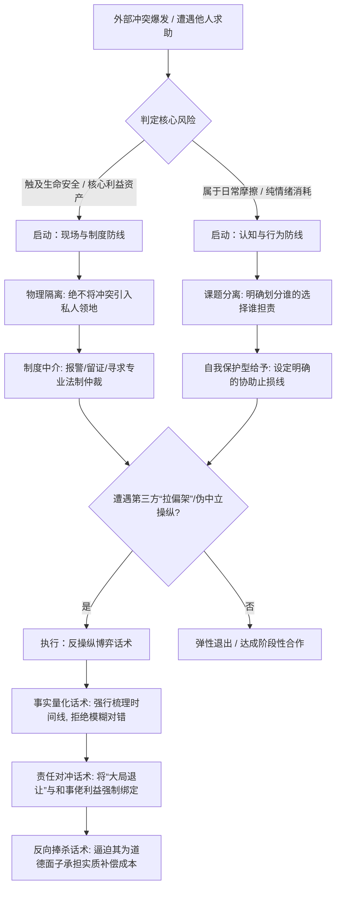

## Table of contents

## 摘要

> 本文内容由 Gemini 生成总结与分析，相关观点仅供参考，不构成专业决策依据。

现代社会在迈向高度法治化与资源存量博弈的过程中，诱发了两个严重的认知失调现象：一是缺乏认知边界的盲目行善频繁遭遇“因果反噬”；二是健全法制划清的司法底线，在客观上沦为部分群体精准卡 Bug 的“合法不道德安全区”。本文系统融合冲突心理学、法经济学与博弈论，首先解构盲目利他导致的卡普曼戏剧三角角色异变，以及低成本第三方干预（俗称“拉偏架”）的伪中立操纵动机；其次，分析法治泛化环境下“战术性遵法”对内在道德动机的挤出效应；最后，摒弃绝对计算的理性万能论，提出一套集认知、行为、现场与话术于一体的“有限理性动态均衡”防御算法。本文旨在为现代人在制度束缚高道德自律者、策略性博弈者利用规则的困境中，提供一套行之有效的非对撞型自保与反操纵行为指引。

## 一、 引言：平面善意与多维自利博弈的错位碰撞

长期以来，“江歌案”等盲目利他惨剧，以及高铁占座、偷拿外卖、劈腿网暴等“合法不道德”行为的激增，在公众心理中引发了长期的认知失调。表面上看起来像“好人没好报”的道德悖论，若从行为科学与理性的视角审视，实则是**单一、缺乏边界的平面善意在对抗复杂的立体利益博弈，以及规则漏洞时遭受的必然维度降击**。

在社会学的结构网格中，个体的当下境遇（如贫困、情感纠纷或极端冲突）往往是其过往选择、人格缺陷以及深层利益博弈的总和。强行介入他人的矛盾纠纷，本质上是以肉身横亘在他人原本发展的因果链条之间，极易使利他者沦为外部混乱转嫁的“跨界风险承担者”。同时，随着社会进入“高存量、低增量”的资源生态，不道德行为的泛滥本质上是策略性博弈者在匮乏生态中通过定向伤害他人、榨取规则红利来获取优势的体现。

因此，解构干预冲突过程中的操纵手段、剖析规则被策略性利用的底层机理，并在感性本能中注入有限理性的防御算法，是现代个体安身立命的核心课题。

## 二、 盲目行善与冲突干涉的心理学反噬机制

### （一） 卡普曼戏剧三角中的动态角色异变

在冲突心理学中，斯蒂芬·卡普曼（Stephen Karpman）提出的“戏剧三角”模型表明，迫害者（Persecutor）、受害者（Victim）和拯救者（Rescuer）三者构成的系统是非静态且不断循环演变的。

```
       [ 迫害者 (Persecutor) ] ───► [ 受害者 (Victim) ]
               ▲                             │
               │                             ▼
               └────────────── [ 拯救者 (Rescuer) ]
```

当高共情但缺乏边界的行动者试图去拯救处于弱势的“受害者”时，他便自动成为“拯救者”。然而，受害者往往伴随着无能感与深层的控制欲，一旦脱困，其心理失衡常转化为对拯救者知情权的怨恨。最终，**原受害者与迫害者极易达成新的利益同盟，反过来将原本的拯救者转化为新的承受风险者**。

### （二） 拯救者情结与白骑士综合征的认知局限

临床心理学研究指出，部分热衷于越界解决他人问题的人，往往患有“拯救者情结”或“白骑士综合征”。这类人群的利他行为并非源于客观风险评估，而是潜意识中对控制欲的渴求，或通过解决他人危机来补偿自我价值的焦虑。不请自来的帮助（Unsolicited Help）在客观上剥夺了当事人面对自身因果、承担选择代价并走向心理成熟的机会，最终导致双方社会关系的双向崩溃。


## 三、 规则泛化与伪中立干预的双重博弈陷阱

除了直接冲突双方的纠葛，现代社会的个体还要面临来自制度机制与第三方的双重博弈陷阱。

### （一） 健全法制下的“合法作恶”与战术性遵法

法经济学与行为法学研究表明，**法制越健全，部分策略性自利博弈者反而越敢于践踏道德底线**。核心原因在于以下两点：

1. **道德动机的“挤出效应”（The Crowding-Out Effect）** [1]：当法律将原本模糊的道德底线通过具体条文“明码标价”时，清晰的惩罚条例反而把不道德行为变成了一场“可以用钱买到的合法交易”，法律成了某些人行为的“天花板”而非底线。
2. **战术性遵法（Strategic Compliance）与安全区作恶**：机会主义行动者会像玩电子游戏一样，去试探法制的机制缺陷。由于现代健全法制追求“无过错不惩罚”与“比例原则”，对于高铁占座、拿小额路边外卖等“微轻伤害”，策略性博弈者深知司法实务中执法程序成本高昂且惩罚弹性极低。**法制的边界越清晰，机会主义者对“安全区”内作恶成本的确定性就越高，这让道德负荷极低的个体找到了心安理得做不道德之事的生存策略**。

### （二） 冲突中伪中立操纵：“拉偏架”的社会学解构

在社会冲突的扩散过程中，民间所谓的“拉偏架”，在社会学中被称为“偏袒型冲突干预”或“伪中立操纵”。

1. **欺软怕硬与成本最小化原则**：非专业第三方（如组织内的和事佬、长辈或基层主管）在面对冲突时，往往遵循“捏软柿子”的低成本原则。因为冲突中的强势方破坏性极强且不易听从劝阻，调解人为了在短时间内快速平息表面的混乱，会本能地向更理智、更顾全大局、更好说话的道德自律型行动者施压，实施不平等的社会规训（Unequal Social Control）。
2. **偏袒调停（Biased Mediation）中的隐性联盟** [2]：拉偏架者通常与冲突中的某一方存在潜在的隐性利益联盟，他们通过扮演中立的“调解人”把控话语权，实质上是在阻止受害者采取激烈的正当防卫，以此为同盟打掩护。

## 四、 认知防线：真伪思想深度的检验指标

在复杂的社会环境中，判断一个人是真正看透因果的认知“智者”，还是仅仅在搭建知识防御墙、故作高深的伪装者，是避免被误导前提。

- **灰度思维与降维沟通**：真正具备思想深度的人，其脑子里能同时容纳两种相反的观念而仍能保持行动能力。在表达上，他们具备极强的“降维沟通”能力，能够将底层逻辑彻底化繁为简，不堆砌行业术语。
- **情绪耐受与低反刍**：真正看清因果的人，明白“夏虫不可以语冰”的客观局限，在面对低认知维度的争论时，往往选择笑而不语或主动顺从，不将精力浪费在无意义的对错争辩上。

## 五、 “有限理性”防御算法的构建与博弈实操

基于上述对反噬机制与规则漏洞的分析，现代人应当用理性的工具升级原始的道德直觉，以下是基于本研究推导出的“冲突介入与反操纵判定流程图”：

冲突介入与反操纵判定流程图



### （一） 核心防御机制

1. **认知防线：践行课题分离与不对称博弈规避**：阿德勒心理学中提出的“课题分离”（Separation of Tasks）是抵御因果反噬的最强认知盾牌。明确分清“这是谁的课题，谁该为此承担代价”，克制自身的“拯救者情结”。同时，行动者必须保持清醒的**不对称博弈意识**：**永远不要试图与“时间机会成本极低”的闲散博弈者纠缠，更不要试图激怒“沉没成本归零、无边际资产可再失去”的极端匮乏者**。在博弈资源高度不对称的结构中，前者拥有近乎无限的廉价闲暇时间，足以耗尽高价值行动者的耐心与精力资产；后者则因彻底丧失未来红利（即“沉没成本为零”），倾向于采取同归于尽的非理性决裂手段（即以“命”为筹码带走他人的未来）。规避此类博弈，是认知防线的首要原则。
2. **行为防线：自我保护型给予（Self-Protective Givers）** [3]：在提供帮助前，先行评估最坏结果。若最坏结果触及个人生命、财产、名誉或家人的安全底线，必须进行一票否决式拒绝。凡涉及他人的情感纠葛或具有暴力倾向的暗处冲突，绝对不在私人领地内为其提供缓冲收留。
3. **现场防线：用制度与专业替代肉身**：国家对暴力惩罚权的绝对垄断，导致法律在形式上率先解除了道德自律者的私力救济武装。因此，当冲突在眼前爆发时，应立即切断用血肉之躯进行感性对抗的本能，通过报警、呼叫专业救援、留存影像证据等方式行善，绝不给对抗方将伤害目标转移至自身的物理机会。

### （二） 反操纵博弈话术实操

一旦在处理冲突或维权时遭遇不公正的第三方“拉偏架”操纵，应采取“提高对方偏袒成本”的算法实施反击：

- **反向推导事实时间线（破解各打五十大板）**：“*我们一码归一码。他先做出的具体行为A是因，我迫于无奈采取的正当防卫是果。如果您认为‘两边都有错’，请您现在具体指出，我的哪一项防卫行为违反了哪一条明文规定？*”
- **责任红利对冲（破解大局观绑架）**：“*我可以为了您口中的‘大局’忍下这一回。但因为他的违规操作，后续如果导致项目流产或不可挽回的损失，这个责任由您出面签字替他承担吗？如果您能保证担责，我现在立刻就退。*”
- **责任出让（破解道德面子）**：“*您一向是最讲公道、最顾全大局的长辈。今天他做出了这种损害集体利益的事情，既然您出面主持大局，那您看他应该拿出什么样的具体补偿和公开道歉方案，才能真正稳住您说的大局？我们全听您的。*”

## 六、 结论与社会生存的动态平衡

本研究表明，传统道德叙事中“无私干涉、盲目利他”的感性直觉，在现代存量博弈与泛法治化的社会生态中具有极高的人身与资产风险。然而，将应对策略完全推向另一端——试图变成一个绝对清醒、凡事计算成本的“完美博弈者”，同样存在落入社会“囚徒困境”、导致信任解体以及因无法应对随机意外而面临系统崩溃的风险。

因此，现代文明社会中较为务实的生存之道，并非追求绝对的算计，而是构筑一种**“有限理性的动态均衡”（Bounded Rationality Equilibrium）**。它承认人类理性的局限与外部世界的模糊性，但同时引入了必要的成本防御机制。

在感性的慈悲与理性的自保之间寻找一个弹性的平衡点，既不盲目牺牲充当他人的因果替代物，亦不走向冷酷极端的精致利己主义。在看清博弈筹码的不对称性后，以审慎、弹性的姿态在不确定的人性网络中释放善意，才是现代社会个体得以安全容身且维持社会温情的务实智慧。

## 参考文献

- [1] Gneezy, U., & Rustichini, A. (2000). *A Fine is a Price*. The Journal of Legal Studies.
- [2] Touval, S., & Zartman, I. W. (1985). *International Mediation in Theory and Practice*. Westview Press.
- [3] Grant, A. (2013). *Give and Take: A Revolutionary Approach to Success*. Viking.
-  Bloom, P. (2016). *Against Empathy: The Case for Rational Compassion*. Ecco.

## 扩展阅读

**格尼兹与鲁斯蒂基尼的行为经济学实验研究（《一行罚款，万事大吉》）**

- **内容摘要**：研究了法律/罚款等正式规则划清界限后，如何将道德负罪感转变为商品交易，从而产生“挤出效应”，导致不道德行为（接孩子迟到）反而增加。
- **文献链接**：Gneezy, U., & Rustichini, A. (2000). A Fine is a Price. *The Journal of Legal Studies*

**国际调停与博弈论中的“偏袒调停”模型（《国际调停的权力与过程》）**

- **内容摘要**：解构了第三方介入冲突时的“伪中立操纵”与隐性利益联盟动机，阐明调解人常带有利己驱动。
- **文献链接**：Touval, S., & Zartman, I. W. (1985). *International Mediation in Theory and Practice*. Westview Press

**组织心理学关于“自我保护型给予者”的研究**

- **内容摘要**：提出在存量博弈环境中，社会成就最高、心理最健康的是具备明确边界线和风险评估机制的“自我保护型给予者（Self-Protective Givers）”。
- **经典原著**：Grant, A. (2013). *Give and Take: A Revolutionary Approach to Success*. Viking.

**认知科学与神经科学关于感性共情反噬的研究**

- **内容摘要**：定量证实缺乏理性的过度共情如何丧失防御能力，并使其沦为自恋型、操纵型人格的榨取对象。
- **经典原著**：Bloom, P. (2016). *Against Empathy: The Case for Rational Compassion*. Ecco.

**社会冲突管理中的“戏剧三角（Karpman Drama Triangle）”理论**

- **内容摘要**：心理学家卡普曼提出的动态模型，完美解释了盲目行善者（拯救者）为何最终会遭到原受害者与迫害者的联手反噬，沦为新的受害者。

**阿德勒心理学中的“课题分离（Separation of Tasks）”理论**

- **内容摘要**：用于解构“干涉他人因果”的本质。明确分清谁的选择谁担责，克制自身的“拯救者情结”，是防御性利他主义的认知防线。
